# Splunk 3 - BOTSv3 Investigation: AWS Breaches, Cryptomining, and APT Endpoint Analysis

**Platform:** TryHackMe
**Difficulty:** Medium
**Type:** Blue Team / Detection (Splunk + BOTSv3)
**Date:** 2026-05-21

---

## Overview

A long-form blue team room built on the **BOTSv3** (Boss of the SOC version 3) dataset. Where BOTSv2 was on-prem-heavy, BOTSv3 adds a large **AWS / cloud** component, which makes it the better room for practicing modern hybrid-environment investigation.

The analyst again plays a SOC analyst at *Frothly*, the fictional craft brewery. The investigation spans five task groups:

1. **AWS and endpoint events.** IAM user enumeration, MFA configuration, hardware inventory, and a misconfigured S3 bucket that was briefly made public.
2. **Cryptomining.** A browser-based Monero miner pinning a workstation CPU, traced through performance counters and Symantec endpoint logs.
3. **More AWS events.** A leaked IAM access key, an AWS abuse-notification email, the leaked key being found in a public GitHub repo, and the attacker's tooling fingerprinted by user-agent.
4. **Endpoint and email events.** A North Korean APT (Taedonggang) delivering a macro-enabled spreadsheet, an embedded executable, a Linux account created by root, a fake Windows service account, and a network scanner.
5. **More endpoint events.** Attack tools downloaded over a non-standard port, files streamed to /tmp, a customer-data leak to Pastebin, and a Base64-encoded PowerShell C2 channel.

This room is heavy on **pivoting between cloud and endpoint telemetry** and on **time correlation**, the skill of using a known timestamp to narrow a noisy search down to the handful of relevant events.

---

**Target:** Frothly hybrid environment (on-prem endpoints plus AWS), BOTSv3 dataset

**Tools:** Splunk SIEM (BOTSv3 corpus), CyberChef, VirusTotal, AWS CloudTrail knowledge, Broadcom/Symantec Security Center, GitHub, Pastebin

---

## Phase 0: Data Source Inventory

As with any BOTS room, the first move is to list the available sourcetypes so the downstream pivots are targeted rather than blind.

```spl
| metadata type=sourcetypes index=botsv3 | sort -lastTime
```

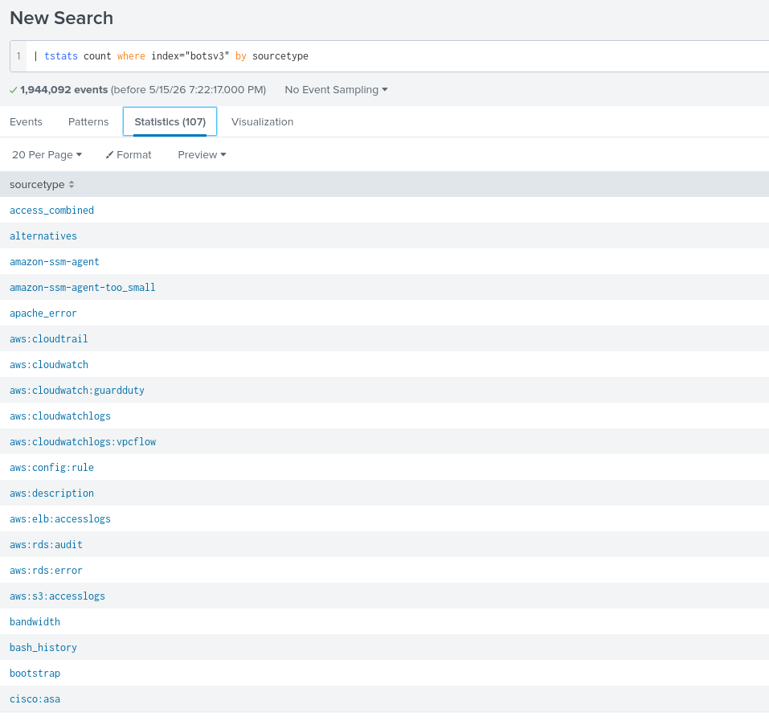

BOTSv3 includes *aws:cloudtrail*, *aws:config*, *aws:description*, *aws:s3:accesslogs*, *ms:o365:management*, *winhostmon*, *hardware*, *perfmonmk:process*, *symantec:ep:security:file*, *osquery:results*, *XmlWinEventLog* (Sysmon), *stream:smtp*, *Unix:ListeningPorts*, and many more. The presence of the *aws:** sourcetypes is what distinguishes this dataset from BOTSv2.

---

## Task 3: AWS and Endpoint Events

### IAM User Enumeration

**AWS CloudTrail** is the AWS service that logs every API call made in an account. It is the cloud equivalent of a Windows security event log. Listing the *userIdentity.userName* field across all CloudTrail records gives every IAM user that touched an AWS service.

```spl
index="botsv3" sourcetype="aws:cloudtrail"
| stats count by userIdentity.userName
| sort -count
```

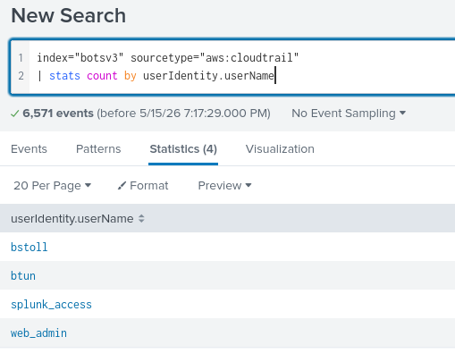

### The MFA Field

**MFA** (multi-factor authentication) is recorded per-session in CloudTrail. The field that states whether a session was MFA-backed is *userIdentity.sessionContext.attributes.mfaAuthenticated*. A detection rule for *sensitive API call where mfaAuthenticated=false* is one of the highest-value cloud alerts a team can write.

```spl
index="botsv3" sourcetype="aws:cloudtrail" *MFA*
```

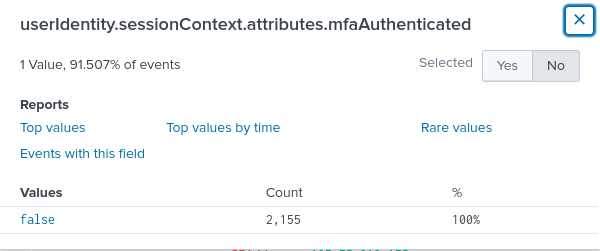

### Hardware Inventory

The *hardware* sourcetype carries CPU, memory, and disk inventory per host. Querying a specific web server host returns its processor model.

```spl
index="botsv3" sourcetype="hardware" host="gacrux.i-09cbc261e84259b54"
```

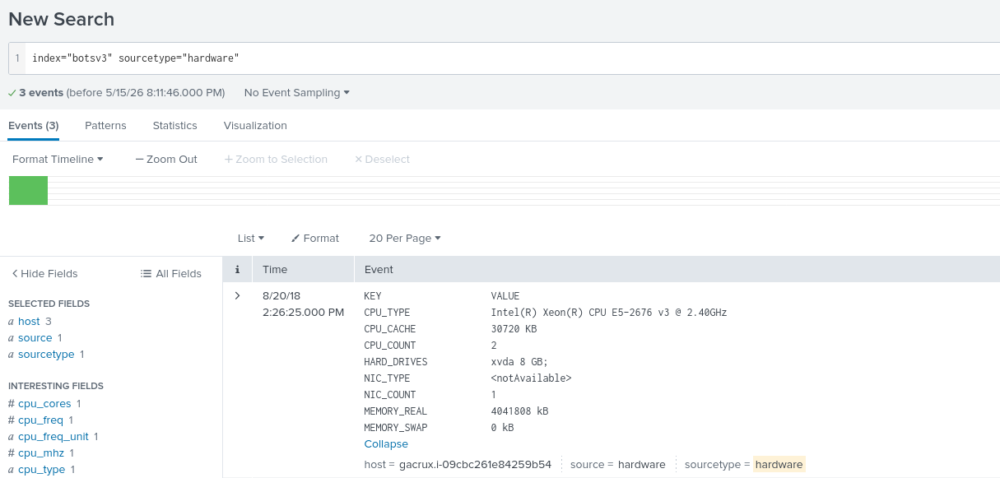

### The Public S3 Bucket

This is the core thread of Task 3. **S3** is AWS object storage, and each bucket has an **ACL** (access control list). The CloudTrail event *PutBucketAcl* records every change to a bucket's ACL. Listing those events shows who changed which bucket.

```spl
index="botsv3" sourcetype="aws:cloudtrail" PutBucketAcl
| table eventID, userIdentity.userName, requestParameters.bucketName
```

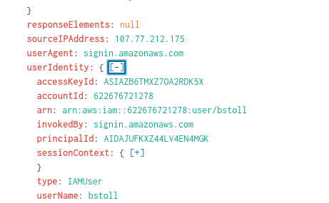

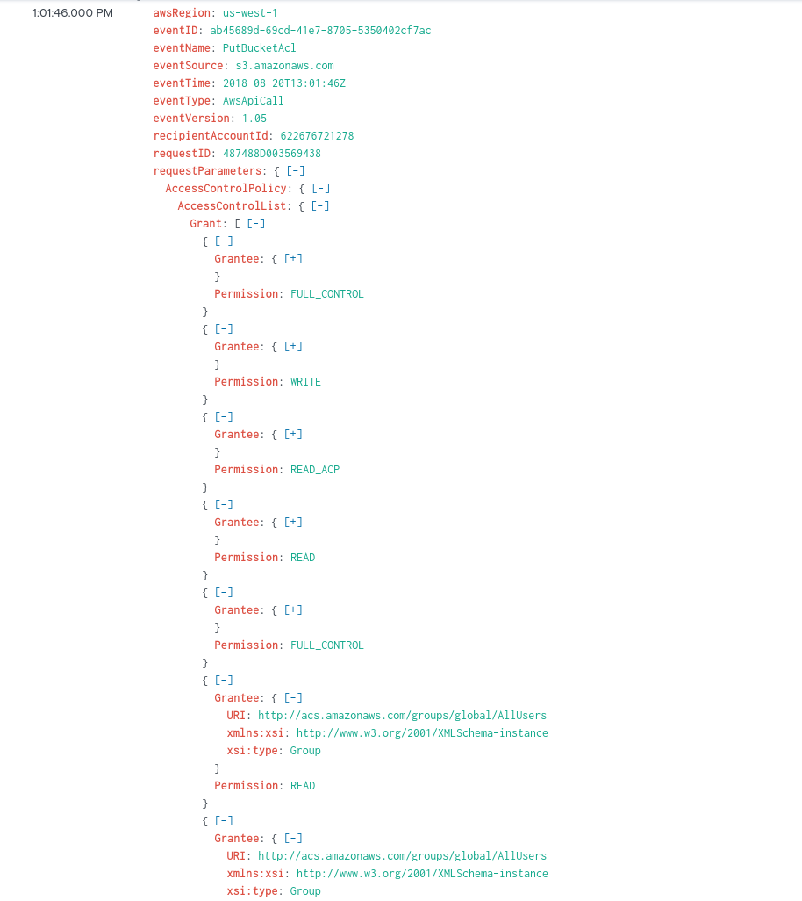


**Key learning:** there were two *PutBucketAcl* events on the same bucket. The malicious one had **AllUsers** in the *Grantee* field with **WRITE** permission, which is exactly what makes an S3 bucket world-writable. The second event had an empty ACL, meaning the user was *revoking* public access. Reading the ACL body, not just the event name, is what tells the two apart.

### File Uploaded While the Bucket Was Public

With the public window known (the timestamps of the two PutBucketAcl events), a time-bounded search for text files in that bucket surfaces what was uploaded by an outsider while it was exposed.

```spl
index="botsv3" frothlywebcode *.txt
```

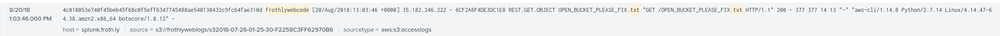

The uploaded filename itself is a not-so-subtle message from whoever found the open bucket.

### The Odd Windows Edition

The *winhostmon* sourcetype monitors Windows host state. Its *operatingsystem* source lists the OS edition per host. Deduplicating by host surfaces the one machine that does not match the fleet.

```spl
index="botsv3" sourcetype="winhostmon" source=operatingsystem
| dedup host
| table host, OS
```

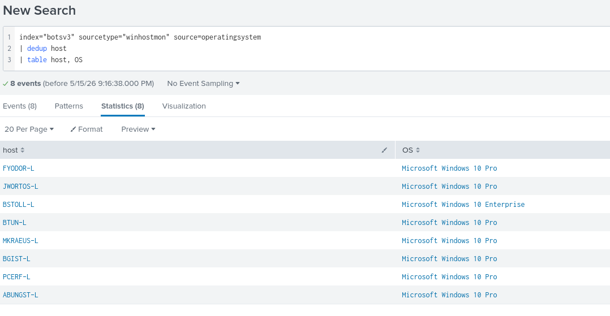

**Key learning:** the entire fleet ran Windows 10 Pro except one endpoint running Windows 10 Enterprise. An OS edition that does not match the standard build is an inventory anomaly worth flagging.

---

## Task 4: Cryptomining Events

### CPU Pinned to 100 Percent

**Cryptomining malware** is most visible through *performance*, because mining pins the CPU. The *perfmonmk:process* sourtype records per-process CPU usage. Filtering for processes at 100 percent, excluding the *_Total* and *Idle* pseudo-instances, surfaces the offenders in time order.

```spl
index="botsv3" sourcetype="perfmonmk:process" "%_Processor_Time"=100
| where instance!="_Total" AND instance!="Idle"
| table _time, host, instance, "%_Processor_Time"
| reverse
```

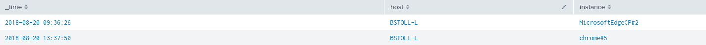

The first process to hit 100 percent was a browser content process in the morning; the second was a Chrome instance in the early afternoon. Browser processes mining crypto points at **browser-based mining** (a malicious site or extension running a miner in JavaScript).

### Identifying the Mining Host

Clicking the offending process instance in Splunk's field sidebar reveals every host associated with that value, which identifies the workstation doing the mining.

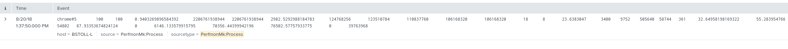

### Symantec Signature and Attack Name

The *symantec:ep:security:file* sourcetype carries Symantec Endpoint Protection detections. Searching it for coin / crypto / monero keywords returns the signature ID and the human-readable attack name.

```spl
index="botsv3" sourcetype="symantec:ep:security:file" coin OR crypto OR monero
| table _time, host, CIDS_Signature_ID, CIDS_Signature_string
```

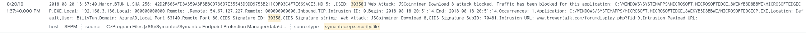

**Key learning:** two detections shared an identical timestamp. Splunk's event-order functions (the order events were indexed, surfaced through internal fields) were needed to determine which signature was *first seen*.

### Threat Severity

The Symantec signature severity is not in the logs. It is looked up externally on the Broadcom / Symantec Security Center site by signature name.

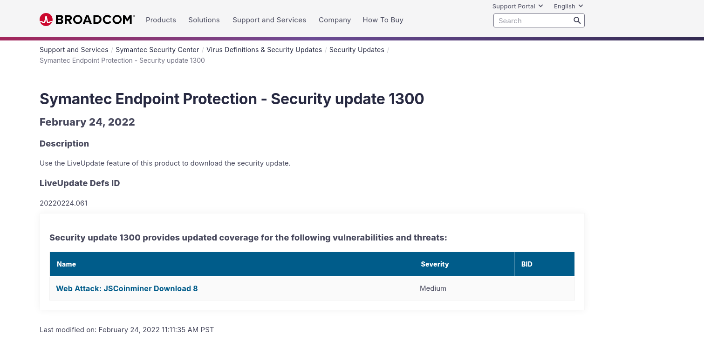

### The Endpoint That Blocked It

Adding the *blocked* keyword to the Symantec search isolates the host where Endpoint Protection actually stopped the threat, as opposed to the host where it ran.

```spl
index="botsv3" sourcetype="symantec:ep:security:file" coin OR crypto OR monero blocked
| table _time, host, CIDS_Signature_String
```

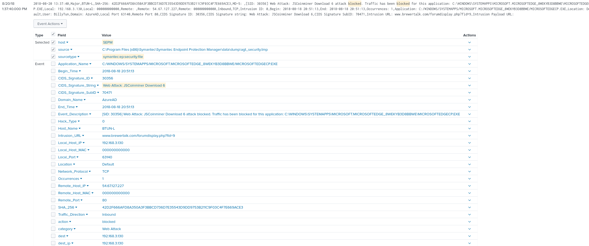

---

## Task 5: More AWS Events

### The IAM Key With the Most Errors

A burst of distinct error types from one IAM access key is a classic *credential-misuse* signature: an attacker with a stolen key probing for what it can do, hitting *AccessDenied* repeatedly. The *dc()* (distinct count) function counts unique error event names per key.

```spl
index="botsv3" sourcetype="aws:cloudtrail" *error* iam
| stats dc(eventName) as distinct_errors by userIdentity.accessKeyId
| sort -distinct_errors
```

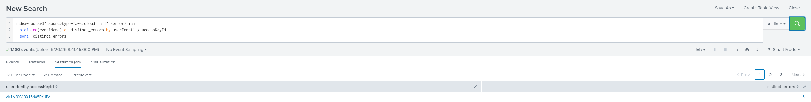

### The AWS Abuse Notification

AWS proactively emails account owners when it detects a compromised credential. Searching SMTP for *compromised* surfaces that email, which includes an AWS support case ID.

```spl
index="botsv3" sourcetype="stream:smtp" compromised
```

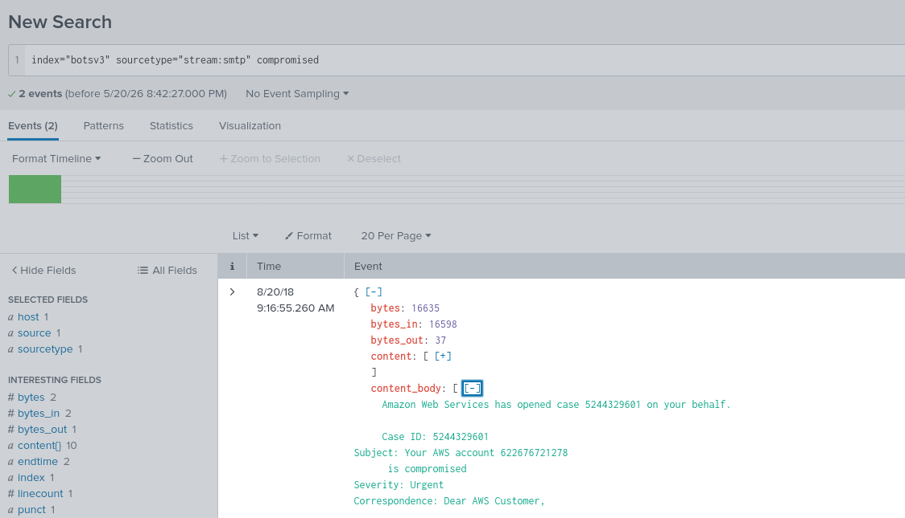

### The Leaked Key in a Public Repo

The AWS notification email contains a GitHub URL pointing at where the credential leaked. Following that URL leads to a *.bak* file in a public Frothly repository containing the plaintext secret access key.

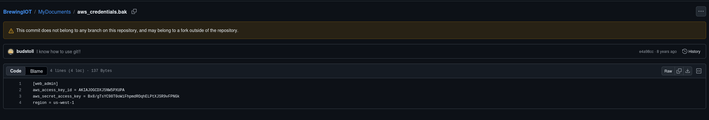

**Key learning:** always follow URLs found in emails and logs. The decisive piece of evidence in this thread was not in Splunk at all; it was in a GitHub repo that an email pointed to. Committing an *aws_credentials.bak* file to a public repo is one of the most common real-world cloud breaches.

### What the Attacker Tried to Create

With the compromised access key known, filtering CloudTrail for that key plus *CreateAccessKey* shows what the attacker attempted, and the *errorCode* / *errorMessage* fields show whether it succeeded.

```spl
index="botsv3" sourcetype="aws:cloudtrail" <compromised-access-key> CreateAccessKey
| table _time, eventName, requestParameters, errorCode, errorMessage
```

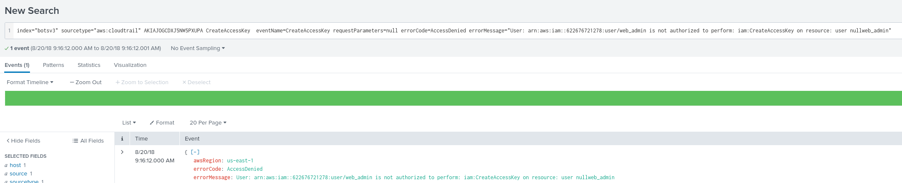

### Fingerprinting the Attacker's Tool

Every AWS API call records the *userAgent* of the client that made it. Grouping by user-agent for the relevant IAM user reveals the application the attacker used.

```spl
index="botsv3" sourcetype="aws:cloudtrail" web_admin
| stats count by userAgent
```

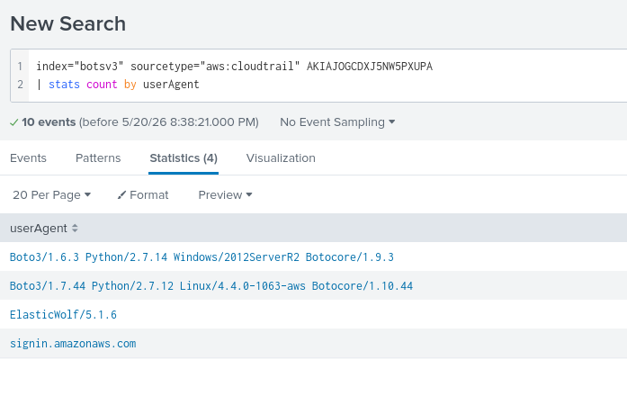

**Key learning:** filtering too tightly (by access key alone) was hiding the attacker's user-agent. Broadening the filter to the *username* exposed every user-agent associated with the account, including the attacker's AWS management GUI tool. Over-filtering hides evidence; start broad, narrow gradually.

---

## Task 6: Endpoint and Email Events

### The Malicious OneDrive Upload

The *ms:o365:management* sourcetype carries Office 365 audit events. Filtering for a *.lnk* file uploaded to OneDrive surfaces the upload event and the *UserAgent* that performed it.

```spl
index="botsv3" sourcetype="ms:o365:management" onedrive *.lnk Operation=FileUploaded
| table _time, UserAgent, Operation, SourceFileName
```

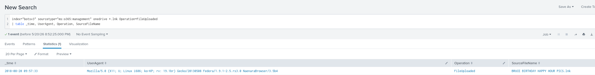

**Key learning:** the user-agent string contained *ko-KP* (the locale code for Korean, North Korea) and **NaenaraBrowser**, the official state-developed web browser of North Korea. That single string is strong attribution evidence for the **Taedonggang** APT.

### The Macro-Enabled Attachment

*.xlsm* is the macro-enabled Excel format. Macros are the most common malware-delivery vehicle in spreadsheets, so any *.xlsm* arriving by email is worth inspecting.

```spl
index="botsv3" *.xlsm
| table _time, host, sourcetype
```

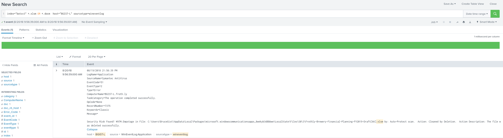

**Key learning:** the filename had a *[number]* suffix added by the email system when it cached the attachment. That suffix is not part of the real filename, a detail that matters when the room asks for the exact name.

### The Embedded Executable

Sysmon process-creation logs (EventCode 1) on the affected host, filtered for the spreadsheet, show the macro spawning a child process. The *ParentCommandLine* and *Image* fields reveal the executable the macro dropped and ran.

```spl
index="botsv3" host="BGIST-L" sourcetype="XmlWinEventLog:Microsoft-Windows-Sysmon/Operational" *.xlsm
| table _time, ParentCommandLine, CommandLine, Image
```

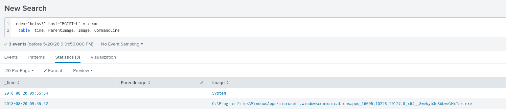

### The Linux Account Created by Root

A keyword search on a Linux host for the account-creation commands surfaces a new user created by root, along with the command line that set its password.

```spl
index="botsv3" hoth useradd OR adduser
```

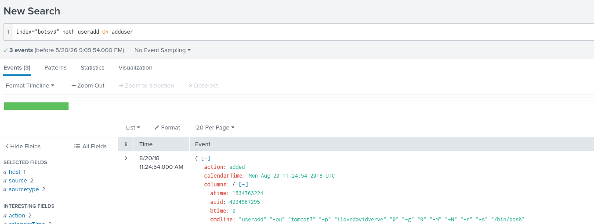

### The Fake Windows Service Account

Windows EventCode 4720 is *a user account was created*. Listing those events surfaces an account that does not follow Frothly's naming convention.

```spl
index="botsv3" EventCode=4720
| table _time, host, Account_Name
```

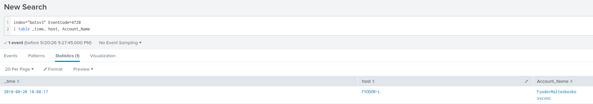

**Key learning:** the created account used an *svc* prefix and a *vnc* reference. The *svc* prefix mimics a real service account, and *vnc* is remote-desktop software. The combination reads as a fake service account staged for remote access persistence.

### Group Membership of the Fake Account

EventCode 4732 is *a member was added to a security-enabled local group*. Filtering for the fake account shows which groups it was added to.

```spl
index="botsv3" svcvnc EventCode=4732
| table _time, host, Group_Name
```

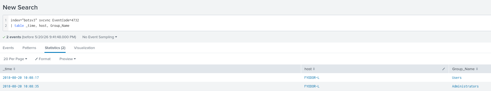

The account was added to the local Administrators group, which is the privilege-escalation half of the persistence setup.

### The Leet Port

Attackers often bind tooling to memorable ports. *1337* is *leet* in leetspeak. The *Unix:ListeningPorts* sourcetype lists open ports per host with the owning process ID.

```spl
index="botsv3" "1337" sourcetype="Unix:ListeningPorts"
| table _time, host, PID, port
```

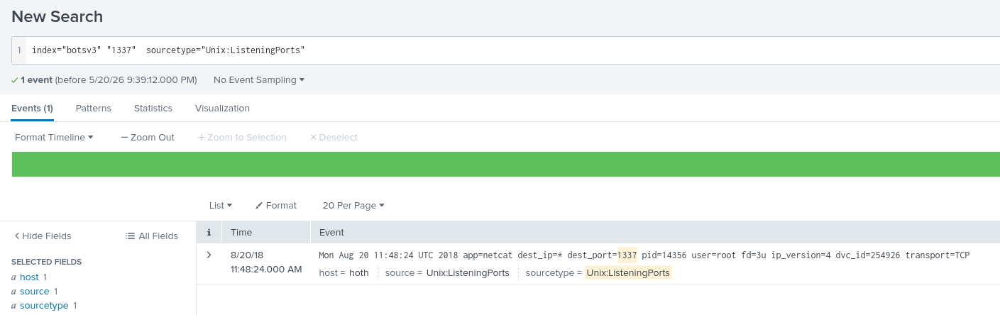

### The Network Scanner

Sysmon process-creation events on the relevant host, grouped by image and sorted, surface an unusual binary running from *C:\Windows\Temp*. Its hash can be pulled and submitted to VirusTotal.

```spl
index="botsv3" host="FYODOR-L" sourcetype="XmlWinEventLog:Microsoft-Windows-Sysmon/Operational" EventCode=1
| stats count by Image
| sort count
```

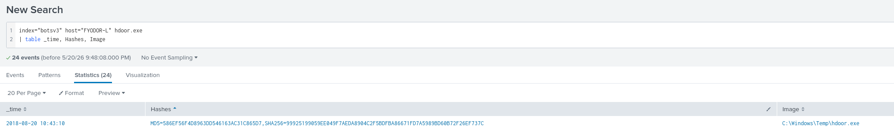

**Key learning:** a binary in *C:\Windows\Temp* with a name designed to look like a legitimate Windows process is a textbook masquerading indicator. Binaries running from temp directories should always be hashed and checked.

---

## Task 7: More Endpoint Events

### The Non-Standard Download Port

Examining the *dest_port* field on the scanner host's outbound network connections reveals the port the attacker used to pull down tooling.

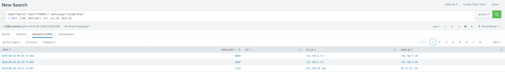

**Key learning:** attackers favor non-standard ports because many monitoring rules only watch the well-known ones (80, 443, 22). A download over an unusual high port is itself a weak signal worth correlating.

### The Disguised Tool File

Filtering the host's traffic to that destination port shows the file that was downloaded.

```spl
index="botsv3" host="FYODOR-L" dest_port=3333
| table _time, sourcetype, dest_port, uri_path
```

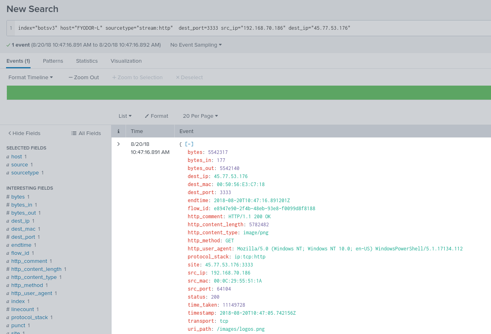

**Key learning:** the downloaded file had an image extension but contained attack tooling. **File masquerading**, hiding executable content behind an innocent file type, is a common evasion. The extension is not the content.

### Files Streamed to /tmp

Using the timestamp of the tool download to set a tight *earliest* / *latest* window, the *osquery:results* sourcetype on the Linux host shows files written to */tmp* in that window.

```spl
index="botsv3" host="hoth" sourcetype="osquery:results" earliest="08/20/2018:11:00:00" latest="08/20/2018:11:30:00"
| table _time, columns.target_path
| dedup columns.target_path
```

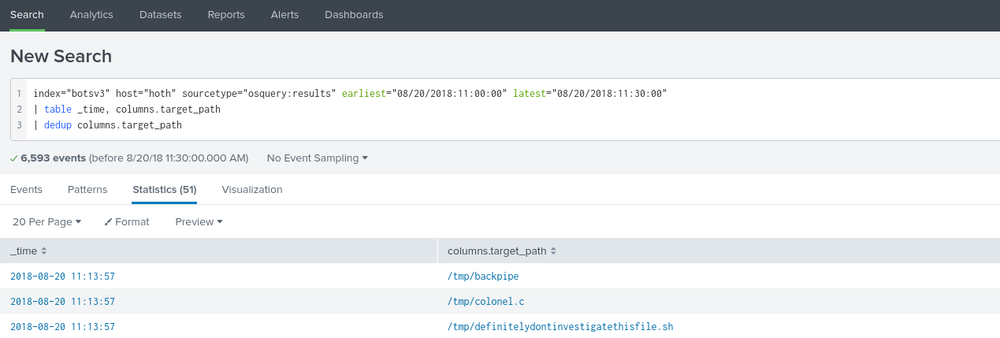

**Key learning:** time correlation was the decisive technique here. The known download timestamp narrowed the search from thousands of osquery records to the handful written in the relevant 30-minute window.

### The Customer Data Leak

SMTP records addressed to the relevant Frothly employee surface an email from an external Naver address (a South Korean mail provider) containing a Pastebin link to leaked customer data.

```spl
index="botsv3" sourcetype="stream:smtp" recipient="*grace*" OR recipient="*ghoppy*"
| table _time, sender, recipient, subject
| sort _time
```

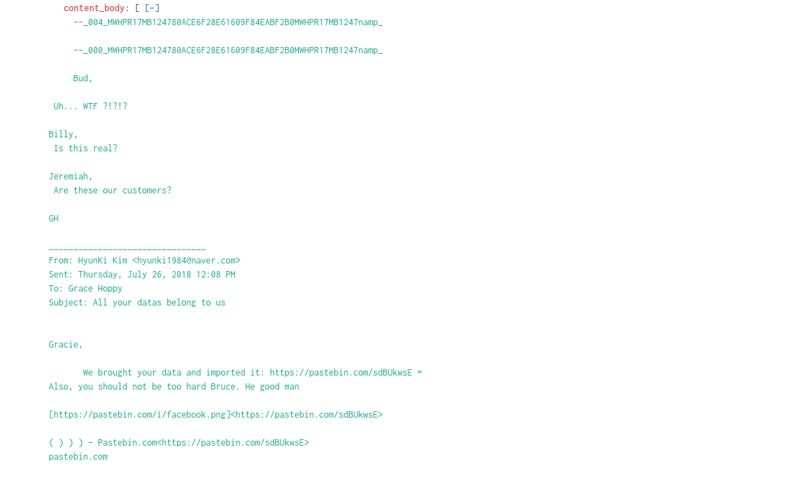

### The C2 URL Path

Filtering Sysmon for processes whose parent is *powershell.exe* surfaces the Base64-encoded PowerShell C2 stager. Decoding it in CyberChef (*From Base64* plus *Remove null bytes*) exposes the C2 variables, including the URL path the beacon requests.

```spl
index="botsv3" sourcetype="xmlwineventlog:microsoft-windows-sysmon/operational" parent_process="C:\\Windows\\System32\\WindowsPowerShell\\v1.0\\powershell.exe"
```

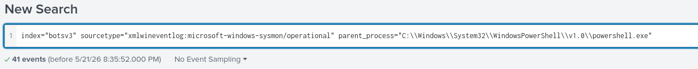

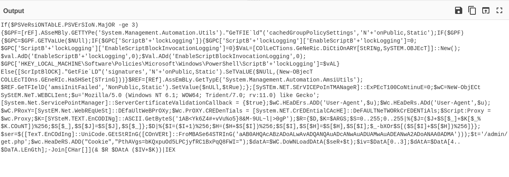

In the decoded script, the *$t=* variable holds the C2 webpage path.

### The Compromised Endpoints

Searching the index for that C2 URL path and grouping by host shows every Frothly endpoint that beaconed to the C2 infrastructure.

```spl
index="botsv3" "<c2-url-path>"
| stats count by host
```

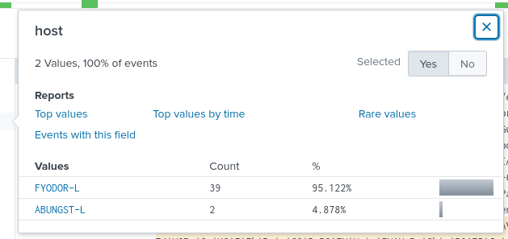

---

## Room Completed

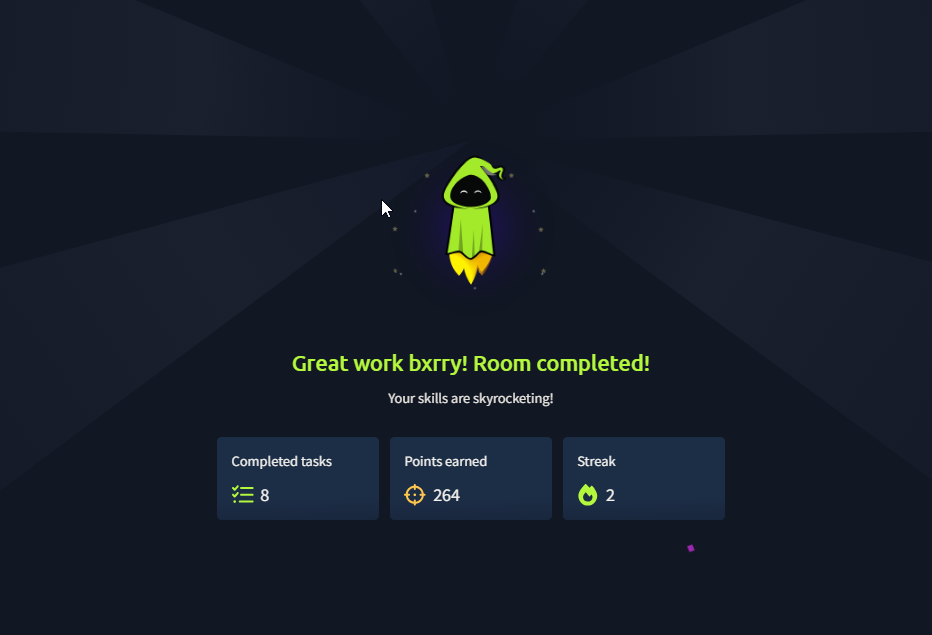

---

## Detection Summary

### S3 Bucket Made Public (CWE-732: Incorrect Permission Assignment)

A *PutBucketAcl* call granted the *AllUsers* group *WRITE* access to a bucket holding web code. Detection and prevention:

- Alert on every *PutBucketAcl* / *PutObjectAcl* CloudTrail event whose ACL body contains *AllUsers* or *AuthenticatedUsers*.
- Enable **S3 Block Public Access** at the account level, which overrides any bucket-level ACL that tries to grant public access.
- Enable **AWS Config** rules *s3-bucket-public-read-prohibited* and *s3-bucket-public-write-prohibited* for continuous compliance checking.

### IAM Credential Compromise (T1078 - Valid Accounts)

A secret access key was committed to a public GitHub repo and used by an attacker. Detection and prevention:

- Never commit credentials to source control. Use *git-secrets* or *trufflehog* as a pre-commit hook and in CI.
- Alert on CloudTrail activity where *mfaAuthenticated=false* for any sensitive action.
- Alert on a single access key generating many distinct *AccessDenied* errors in a short window, which is the signature of an attacker probing a stolen key.
- Rotate IAM keys regularly and prefer short-lived role credentials over long-lived user keys.

### Browser-Based Cryptomining (T1496 - Resource Hijacking)

A workstation CPU was pinned by a browser process mining Monero. Detection:

- Alert on sustained 100 percent CPU by a browser content process.
- Block known mining-pool domains and *coinhive*-style script sources at the proxy.
- Endpoint protection with coin-miner signatures (the Symantec detections in this room) catches the known families.

### Taedonggang APT Endpoint Compromise (multiple techniques)

A macro-enabled spreadsheet led to an embedded executable, a fake service account, a Linux account created by root, a network scanner, and a PowerShell C2 channel. Detection:

- Block or sandbox macro-enabled Office attachments (*.xlsm, .docm*) from external senders.
- Alert on EventCode 4720 (account creation) and 4732 (group membership change) for any account that does not match the naming convention.
- Alert on binaries executing from *C:\Windows\Temp* and other temp directories.
- Alert on PowerShell with *-EncodedCommand* spawned from an Office process.
- Alert on listeners bound to unusual ports and on outbound connections to unusual high ports.

---

## Key Takeaways

- **BOTSv3 is the room to do for cloud investigation practice.** CloudTrail is the AWS equivalent of a security event log, and the *userIdentity*, *eventName*, *requestParameters*, and *userAgent* fields are the cloud analyst's core pivots.
- **Read the ACL body, not just the event name.** Two *PutBucketAcl* events looked identical at the event-name level. One granted public write, the other revoked it. The difference was only visible in the grantee and permission fields.
- **Follow every URL in every email and log.** The decisive evidence in the IAM compromise was a *.bak* file in a public GitHub repo that an AWS notification email pointed to. It was never in Splunk.
- **Over-filtering hides evidence.** Filtering AWS logs by access key alone hid the attacker's user-agent. Broadening to the username exposed it. Start broad, narrow gradually.
- **Time correlation is the highest-leverage technique in the room.** A known timestamp from one event (a file download) narrowed an osquery search from thousands of records to the handful that mattered.
- **User-agent strings carry attribution.** *ko-KP* plus *NaenaraBrowser* is North Korean state software. A single user-agent field tied the endpoint activity to the Taedonggang APT.
- **The extension is not the content.** A file with an image extension contained attack tooling. Masquerading by file type is common; hash the file and inspect it.
- **Naming conventions are a detection control.** The fake *svcvnc* account stood out only because Frothly had a consistent account-naming standard. Anomalies are only visible against a known-good baseline.
