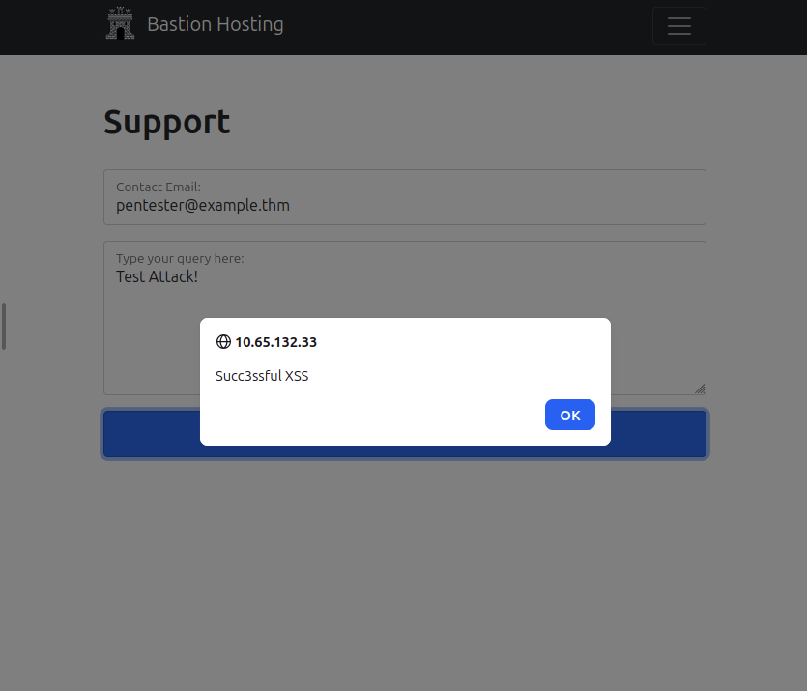

TryHackMe Easy offensive

# Burp Suite: The Basics

An intro to Burp Suite, the standard tool for testing web apps. Burp sits between your
browser and the web server and captures the HTTP/HTTPS traffic, so you can read and change
requests before they reach the server. This room is mostly setup and navigation, then ends
with a real example: bypassing a client-side filter to land a reflected XSS on a support
form. Target was a demo app called Bastion Hosting.

## What Burp is

Burp is a Java tool that proxies your web traffic. You can view, change, or drop requests,
and send them to other Burp tools. Three editions:

- Community: free, manual testing. What this room uses.
- Professional: paid. Adds an automated scanner and unlimited fuzzing.
- Enterprise: paid. Runs on a server and scans continuously, like Nessus for infrastructure.

The Community tools worth knowing: Proxy (intercept traffic), Repeater (resend a request
with tweaks), Intruder (spray requests for brute-force or fuzzing), Decoder, Comparer, and
Sequencer (test how random tokens are).

## Setting up the proxy

To send browser traffic through Burp, point Firefox at Burp using FoxyProxy: IP 127.0.0.1,
port 8080. Turn it on, then set Intercept in Burp's Proxy tab. Intercept on = requests pause
in Burp until you forward them. Intercept off = traffic flows but still logs in HTTP history.

Burp also has its own built-in browser (Open Browser in the Proxy tab) already wired to the
proxy, so no FoxyProxy needed. On the AttackBox it runs as root, so you enable "run without a
sandbox" to launch it.

For HTTPS sites, the browser throws a certificate error because Burp swaps in its own
certificate to read the encrypted traffic. The fix is to install Burp's CA cert (from
http://burp/cert) in the browser. The AttackBox already has this done.

## Site map: finding hidden endpoints

The Target tab builds a Site map as you browse: a tree of every page visited. Its Live
Passive Crawl also reads each page's HTML and JavaScript and adds any links it finds, even
ones you never clicked.

Browsing the target that way surfaced an endpoint that did not fit the normal pages (about,
contact, products): a random path, `/5yjR2GLcoGoij2ZK`. It only appeared after loading the
page that linked to it. Visiting it directly returned a flag. The lesson: the site map turns
up endpoints you would never guess from clicking around.

## Scope: cutting the noise

Without scope, Burp logs and intercepts everything, including background browser traffic.
Right-click the target and Add to scope to limit logging. Scope alone does not stop
interception, though. To make the proxy only pause your target's traffic, add the Proxy rule
"URL Is in target scope." Result: a clean view with only the traffic you care about.

## Example attack: reflected XSS through the proxy

The support form at `/ticket/` has a client-side filter that blocks special characters in the
email field. Client-side filters only run in the browser, so they fall apart once the request
leaves it.

Steps:

1. Submit the form with clean data (email `pentester@example.thm`, query `Test Attack`) to
   get past the filter.
2. With Intercept on, Burp catches the POST to `/ticket/`.
3. In the paused request body, replace the email value with the payload
   ``.
4. Select just the payload and press Ctrl+U to URL-encode it, so the special characters travel
   cleanly.
5. Forward the request, then switch back to the browser.

The server reflected the payload into the page and it ran:

This is Reflected XSS. It only affects the person making the request, but it proves the input
is not sanitized server-side.

## Key Takeaways

- Burp sits between the browser and the server, so you can change any request after it leaves the browser.
- Intercept on pauses traffic, intercept off just logs it. Know which mode you are in or the browser will hang.
- The site map finds hidden endpoints by reading page HTML and JavaScript, not just what you click.
- Set a scope early to cut out background noise and only capture your target.
- Client-side filters are not security. You bypass them by editing the request in the proxy.
- Ctrl+U URL-encodes a selection, which is how you send special characters in a payload safely.
