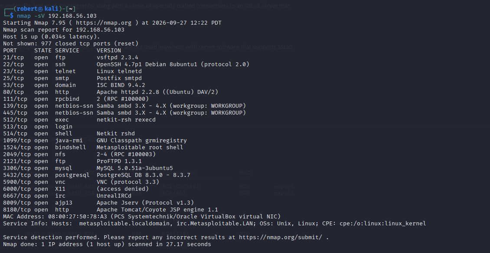
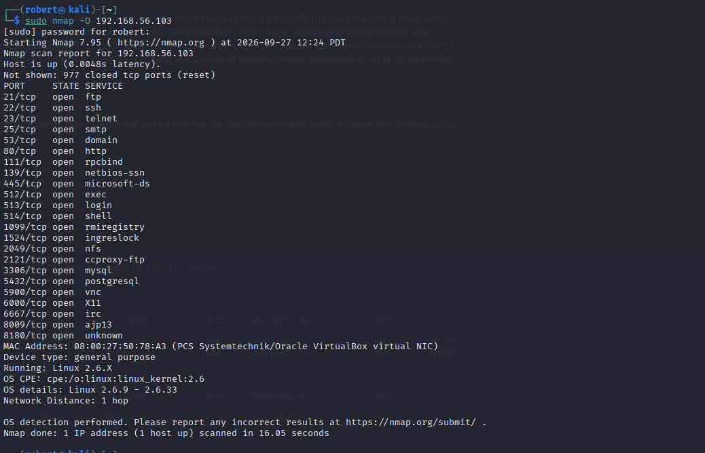
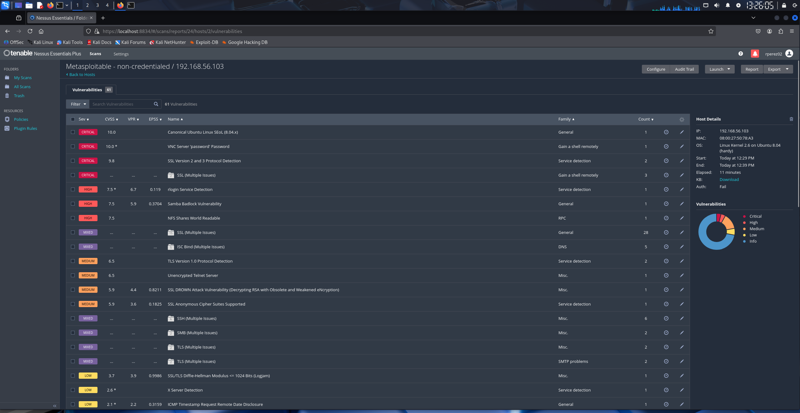
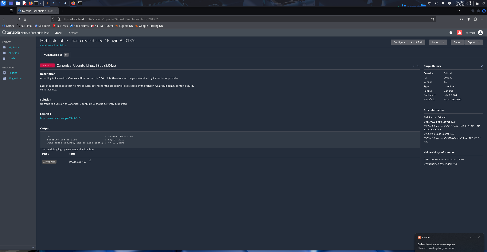
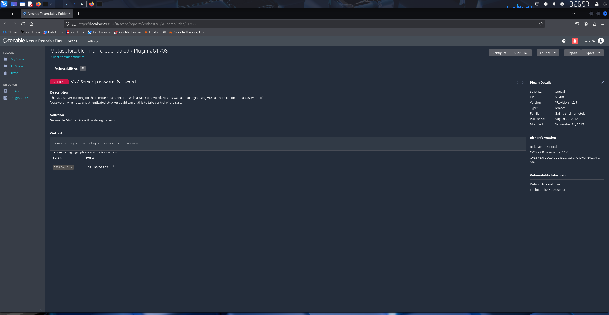
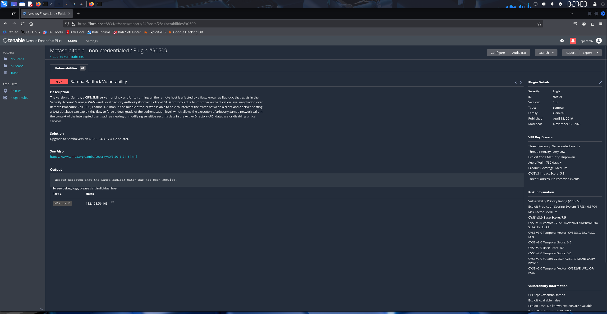
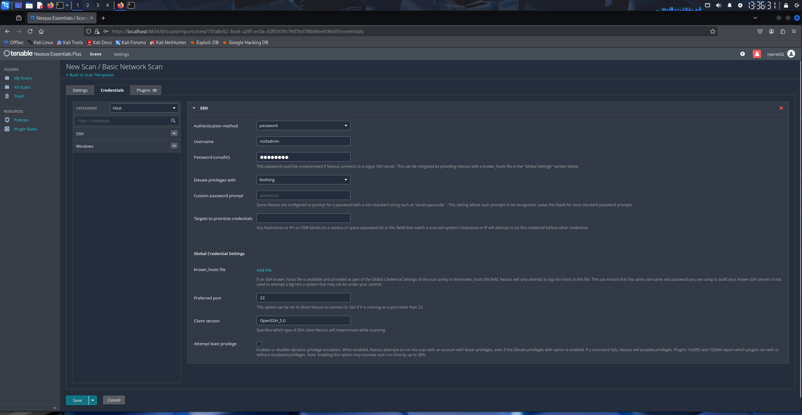
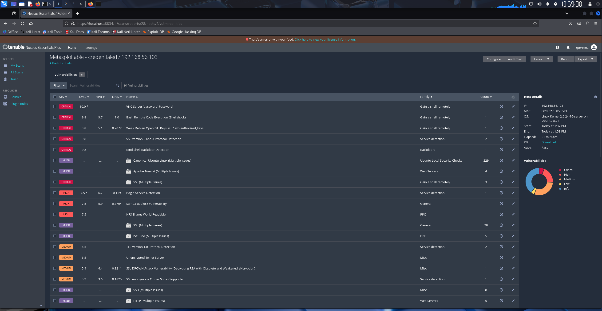

# Vulnerability Scan Lab: Nmap and Nessus against Metasploitable 2

**Date:** 2026-09-27
**Tools:** VirtualBox, Kali Linux, Nmap, Nessus Essentials, Metasploitable 2
**Focus:** The vulnerability management workflow, discover, scan, prioritize, report.

## What this lab is

A weekend lab where I built a small isolated network, scanned an intentionally vulnerable machine, and triaged the findings the way a SOC analyst would. The point was to run the full vulnerability management cycle rather than just fire a scanner.

## Setup

Both machines sit on a VirtualBox host-only network, `192.168.56.0/24`. Host-only means the machines can reach each other and my PC, but not the internet or my home network. That matters because Metasploitable 2 is full of holes and should never be reachable from outside.

- Kali (analyst box) and Metasploitable (target) both on the host-only adapter, nothing else.
- Target IP: `192.168.56.103`.

Note to self: keep VM disks out of Downloads. My Metasploitable disk went missing because I had cleared Downloads, where it used to live. I re-downloaded it and moved it into `C:\Users\<user>\VirtualBox VMs` so a cleanup will not delete it again.

## Step 1: Discovery with Nmap

Before scanning for vulnerabilities you map what is running. This is the asset inventory step.

```
nmap -sV 192.168.56.103
```

`-sV` detects service versions, so it does not just say "port 21 open", it says `vsftpd 2.3.4`. Versions are what you match against known vulnerabilities later.

Result: 23 open ports, old software everywhere, including `vsftpd 2.3.4`, `OpenSSH 4.7`, `Apache 2.2.8`, `MySQL 5.0.51a`, Samba, and a leftover backdoor on port 1524. A normal server exposes maybe three or four ports. Every open port here is attack surface.



OS detection needs raw socket access, so it runs with sudo:

```
sudo nmap -O 192.168.56.103
```

Result: Linux kernel 2.6, Ubuntu 8.04. That dates the box to around 2008.



## Step 2: Vulnerability scan with Nessus

In Nessus I made a Basic Network Scan, target `192.168.56.103`, non-credentialed, common ports. This is a basic discovery scan, the default outside-in view.

Non-credentialed means Nessus scanned from the outside with no login to the target. That is the attacker's view. A credentialed scan gives Nessus a login so it can read patch levels and config from the inside, which finds more and gives fewer false positives. I run that credentialed scan later in this writeup.

The scan ran about 11 minutes and returned 61 findings: 4 critical, 3 high, plus mediums and lows.



## Step 3: How to read a finding

Every Nessus finding has the same parts:

- **Description**: what is wrong.
- **Solution**: how to fix it.
- **Output**: Nessus's proof, so nobody argues the finding.
- **Risk Information**: the scores and the CVSS vector.

Example, the Ubuntu 8.04 end-of-life finding, CVSS 10.0, vector `AV:N/AC:L/PR:N/UI:N`:

- `AV:N` attack vector network, exploitable remotely.
- `AC:L` attack complexity low, easy.
- `PR:N` no privileges needed.
- `UI:N` no user has to click anything.

Remote, unauthenticated, no click. Worst case on every metric, which is why it scores 10.



## Step 4: Triage

Three scores drive the order of work:

- **CVSS**: severity, 0 to 10.
- **EPSS**: chance it gets exploited soon.
- **VPR**: Tenable's blended score using observed threat activity.

Fix first what is both severe and easy to exploit. My top priorities:

1. VNC with the password set to "password", CVSS 10. Instant remote control, no skill needed.
2. Ubuntu 8.04 end of life, CVSS 10. No patches exist, so the fix is replacing the OS.
3. NFS world-readable shares, 7.5. Easy data theft.



Samba Badlock scored 7.5 and its EPSS was 0.37, which looked urgent. But the finding detail told a different story: threat drivers said "no known exploits" and "unproven", and the CVSS vector had `AC:H` (high complexity) and `UI:R` (user interaction required). That means the attacker has to already be sitting in the middle of the traffic. So I ranked it below the easy wins.

Lesson: EPSS is a prediction, the finding detail is evidence. When they disagree, read the finding.



## What I would do on the job

Open a ticket per finding for the asset owner, whether that is IT or the product owner, so they can prioritize and assign the fix. Give management a short summary with the risk level and what is at stake, not the raw 61-line scan.

## Compensating controls

Some findings cannot be fixed right away. An end-of-life OS cannot be patched at all. When you cannot patch, you reduce the risk another way:

- Isolate the host on its own network segment.
- Firewall the risky ports so only trusted systems can reach them.
- Increase monitoring on the host.

## Credentialed scan: the inside view

I ran the same scan again with SSH credentials (`msfadmin`) so Nessus could log into the host.



| | Non-credentialed | Credentialed |
|---|---|---|
| Auth | Fail | Pass |
| Findings | 61 | 91 |

With a login, Nessus read the installed packages and patch levels and surfaced things the outside scan could not see:

- Bash Remote Code Execution (Shellshock), CVSS 9.8, EPSS 1.0. A known, actively exploited flaw.
- Weak Debian OpenSSH Keys in `authorized_keys`, CVSS 9.8.
- Canonical Ubuntu Linux missing patches, 229 grouped items under Ubuntu Local Security Checks.



Takeaway: a non-credentialed scan shows what an attacker sees from the network. A credentialed scan shows what is actually installed and unpatched inside the host. Run credentialed when you can, it is more complete and has fewer false positives.

## Takeaways

- Host-only networking keeps a vulnerable box safe to study.
- Nmap maps the attack surface, Nessus scores it.
- CVSS is the start, not the end. EPSS and the finding detail can change the order.
- An end-of-life OS cannot be patched. The fix is replacement or isolation.

---

The full findings report is in [vuln-report.md](vuln-report.md).
